Voom analysis of flow sorted brain ATAC-seq
================
Peter Hickey
3 July 2017

# Summary

We used
[**Bowtie2**](http://bowtie-bio.sourceforge.net/bowtie2/index.shtml) to
align reads for the 27 ATAC-seq libraries to hg19. Duplicate reads were
marked using [**Picard
MarkDuplicates**](http://bowtie-bio.sourceforge.net/bowtie2/index.shtml)
. Peaks were called using MACS2 by combining all non-duplicate,
high-quality (mapQ \> 30) alignments from each condition (`NAcc_pos`,
`NAcc_neg`, `BA9_pos`, `BA9_neg`) into a single BAM file; `narrowPeak`
regions were used. The union of all condition-specific `narrowPeak`
regions defined the `union_narrowPeak_reduced` that we use for testing
for differential accessibility. For each sample, we tallied the number
of non-duplicate, high-quality (mapQ \> 30) alignments overlapping each
region using `GenomicAlignments::summarizeOverlaps()`. Only 22/27
samples are used in the analysis (the 5 remaining samples are technical
replicates). Only regions with more than 1 count per million (cpm) in at
least 5 libraries (the size of the smallest group of samples) were
retained for analysis.

We then used `limma::voom()` to convert these normalised counts to
\(log_2\)-cpm, with associated weights, ready for linear modelling. The
design matrix included additive terms for `DONOR` and `TISSUE_NEUN`
(`~ 0 + TISSUE_NEUN + DONOR`), i.e. we block on `DONOR`. We ran
[**sva**](https://bioconductor.org/packages/release/bioc/html/sva.html)
and identified 4 SVs (although compared to the RNA-seq data, it is less
obvious what is driving the SVs. We include all 4 SVs in the design
matrix.

We tested for differential accessibility between:

1.  `NA_pos` and `BA_pos` (`NA_posvsBA9_pos`)
2.  `NA_neg` and `BA_neg` (`NA_negvsBA9_neg`)
3.  `(NA_pos + BA9_pos) / 2` and `(NA_neg + BA9_neg) / 2`
    (`ave_pos_vs_ave_neg`)

## Deliverables

| Comparison             | CSV of `topTable()` output for all regions                                                                         | CSV of DARs                                                                                                | CSV of DARs (abs(logFC \> 1)                                                                                                             |
| ---------------------- | ------------------------------------------------------------------------------------------------------------------ | ---------------------------------------------------------------------------------------------------------- | ---------------------------------------------------------------------------------------------------------------------------------------- |
| NA\_posvsBA9\_pos      | [`../extdata/topTable.NA_posvsBA9_pos.ATAC-seq.csv.gz`](../extdata/topTable.NA_posvsBA9_pos.ATAC-seq.csv.gz)       | [`../extdata/DARs.NA_posvsBA9_pos.ATAC-seq.csv.gz`](../extdata/DARs.NA_posvsBA9_pos.ATAC-seq.csv.gz)       | [`../extdata/DARs_with_logFCgeq1.NA_posvsBA9_pos.ATAC-seq.csv.gz`](../extdata/DARs_with_logFCgeq1.NA_posvsBA9_pos.ATAC-seq.csv.gz)       |
| NA\_negvsBA9\_neg      | [`../extdata/topTable.NA_negvsBA9_neg.ATAC-seq.csv.gz`](../extdata/topTable.NA_negvsBA9_neg.ATAC-seq.csv.gz)       | [`../extdata/DARs.NA_negvsBA9_neg.ATAC-seq.csv.gz`](../extdata/DARs.NA_negvsBA9_neg.ATAC-seq.csv.gz)       | [`../extdata/DARs_with_logFCgeq1.NA_negvsBA9_neg.ATAC-seq.csv.gz`](../extdata/DARs_with_logFCgeq1.NA_negvsBA9_neg.ATAC-seq.csv.gz)       |
| ave\_pos\_vs\_ave\_neg | [`../extdata/topTable.ave_pos_vs_ave_neg.ATAC-seq.csv.gz`](../extdata/topTable.ave_pos_vs_ave_neg.ATAC-seq.csv.gz) | [`../extdata/DARs.ave_pos_vs_ave_neg.ATAC-seq.csv.gz`](../extdata/DARs.ave_pos_vs_ave_neg.ATAC-seq.csv.gz) | [`../extdata/DARs_with_logFCgeq1.ave_pos_vs_ave_neg.ATAC-seq.csv.gz`](../extdata/DARs_with_logFCgeq1.ave_pos_vs_ave_neg.ATAC-seq.csv.gz) |

# Full analysis

## Load packages

``` r
library(SummarizedExperiment)
library(limma)
library(edgeR)
library(sva)
library(scales)
```

## Load data and construct a *DGEList* object of normalised counts

Construct *DGEList* objects for use with
[**voom**](https://bioconductor.org/packages/voom) from the
*SummarizedExperiment* objects created in
[`../scripts/make-SummarizedExperiment.R`](../scripts/make-SummarizedExperiment.R).
Spefically, make one object for the data for the all samples with rows
corresponding to MACS2 peaks called from all 27 libraries (the ‘overall’
peakset).

**NOTE:** We only retain autosomal peaks.

We have a few libraries as technical replicates; for simplicity, we just
select the first of these technical replicate libraries,

``` r
se <- 
  readRDS("../objects/flow-sorted-brain-atac.union_narrowPeak_reduced.se.rds")
se$NEUN_COLOR <- ifelse(se$NEUN_COLOR == "firebrick3", "purple", "darkgreen")

# Drop rep2 libraries
se <- se[, se$REPLICATE == "rep1"]

# Drop non-autosomal peaks
se <- keepSeqlevels(se, paste0("chr", 1:22), pruning.mode = "coarse")

# Construct DGEList object
dgelist <- DGEList(counts = assay(se, "counts"),
                   lib.size = colSums(assay(se, "counts")),
                   samples = colData(se),
                   genes = as.data.frame(rowRanges(se)))
dim(dgelist)
#> [1] 836123     22
```

### Filter out peaks that are lowly enriched in most samples

[Gordon
says](https://stat.ethz.ch/pipermail/bioconductor/2012-September/047995.html):

> Note that our recommended filtering is `keep <- rowSums(cpm(dge) > k)
> >= X`, where `X` is the sample size of the smallest group size … You
> are also free to vary k, depending on your sequencing depth.

Our smallest group size contains 5 samples. We explore a range of `k`

``` r
# Group sizes
xtabs(~ TISSUE + NEUN, dgelist$samples)
#>       NEUN
#> TISSUE neg pos
#>    BA9   6   6
#>    NA    5   5

# Vary k from 0 (no filtering) to k = 5
sapply(0:5, function(k) sum(rowSums(cpm(dgelist) > k) >= 5))
#> [1] 836123 283812 114692  67509  46564  35363
```

We use `k = 1`, keeping 34% of peaks for differential testing. As a
point of reference, Greenleaf report most of his data with respect to a
set of 50,000 ‘top’ peaks.

``` r
keep <- rowSums(cpm(dgelist) > 1) >= 5
dgelist <- dgelist[keep, ]
dim(dgelist)
#> [1] 283812     22
```

Next, perform TMM normalisation

``` r
dgelist <- calcNormFactors(dgelist)
```

We now have normalised counts in a *DGEList*

## Including `DONOR` in the design matrix

### Design matrix

At this point, we need to specify design matrix. We have an almost
balanced design with 22 ATAC-seq libraries from 6 donors in 4
conditions.

``` r
xtabs(~ DONOR + TISSUE_NEUN, dgelist$samples)
#>       TISSUE_NEUN
#> DONOR  BA9_neg BA9_pos NA_neg NA_pos
#>   5343       1       1      1      1
#>   5347       1       1      1      1
#>   5358       1       1      1      1
#>   5404       1       1      0      0
#>   5456       1       1      1      1
#>   5540       1       1      1      1
```

We have (mostly) the same 6 donors in the 4 conditions, so we block on
`DONOR` to make all subsequent comparisons ‘within `DONOR`’.

``` r
design <- model.matrix(~ 0 + TISSUE_NEUN + DONOR, dgelist$samples)
colnames(design) <- gsub("TISSUE_NEUN", "", colnames(design))
design
#>                   BA9_neg BA9_pos NA_neg NA_pos DONOR5347 DONOR5358
#> 5343-BA9-neg.rep1       1       0      0      0         0         0
#> 5343-BA9-pos.rep1       0       1      0      0         0         0
#> 5343-NA-neg.rep1        0       0      1      0         0         0
#> 5343-NA-pos.rep1        0       0      0      1         0         0
#> 5347-BA9-neg.rep1       1       0      0      0         1         0
#> 5347-BA9-pos.rep1       0       1      0      0         1         0
#> 5347-NA-neg.rep1        0       0      1      0         1         0
#> 5347-NA-pos.rep1        0       0      0      1         1         0
#> 5358-BA9-neg.rep1       1       0      0      0         0         1
#> 5358-BA9-pos.rep1       0       1      0      0         0         1
#> 5358-NA-neg.rep1        0       0      1      0         0         1
#> 5358-NA-pos.rep1        0       0      0      1         0         1
#> 5404-BA9-neg.rep1       1       0      0      0         0         0
#> 5404-BA9-pos.rep1       0       1      0      0         0         0
#> 5456-BA9-neg.rep1       1       0      0      0         0         0
#> 5456-BA9-pos.rep1       0       1      0      0         0         0
#> 5456-NA-neg.rep1        0       0      1      0         0         0
#> 5456-NA-pos.rep1        0       0      0      1         0         0
#> 5540-BA9-neg.rep1       1       0      0      0         0         0
#> 5540-BA9-pos.rep1       0       1      0      0         0         0
#> 5540-NA-neg.rep1        0       0      1      0         0         0
#> 5540-NA-pos.rep1        0       0      0      1         0         0
#>                   DONOR5404 DONOR5456 DONOR5540
#> 5343-BA9-neg.rep1         0         0         0
#> 5343-BA9-pos.rep1         0         0         0
#> 5343-NA-neg.rep1          0         0         0
#> 5343-NA-pos.rep1          0         0         0
#> 5347-BA9-neg.rep1         0         0         0
#> 5347-BA9-pos.rep1         0         0         0
#> 5347-NA-neg.rep1          0         0         0
#> 5347-NA-pos.rep1          0         0         0
#> 5358-BA9-neg.rep1         0         0         0
#> 5358-BA9-pos.rep1         0         0         0
#> 5358-NA-neg.rep1          0         0         0
#> 5358-NA-pos.rep1          0         0         0
#> 5404-BA9-neg.rep1         1         0         0
#> 5404-BA9-pos.rep1         1         0         0
#> 5456-BA9-neg.rep1         0         1         0
#> 5456-BA9-pos.rep1         0         1         0
#> 5456-NA-neg.rep1          0         1         0
#> 5456-NA-pos.rep1          0         1         0
#> 5540-BA9-neg.rep1         0         0         1
#> 5540-BA9-pos.rep1         0         0         1
#> 5540-NA-neg.rep1          0         0         1
#> 5540-NA-pos.rep1          0         0         1
#> attr(,"assign")
#> [1] 1 1 1 1 2 2 2 2 2
#> attr(,"contrasts")
#> attr(,"contrasts")$TISSUE_NEUN
#> [1] "contr.treatment"
#> 
#> attr(,"contrasts")$DONOR
#> [1] "contr.treatment"
```

Under this design matrix, the baseline is donor 5343 (`DONOR5343`).

After blocking on `DONOR` we have 13 residual degrees of freedom.

### Transformation with `limma::voom()`

We use `limma::voom()` to convert these normalised counts to
\(log_2\)-cpm, with associated weights, ready for linear
modelling.

``` r
elist <- voom(counts = dgelist, design = design, plot = TRUE)
```

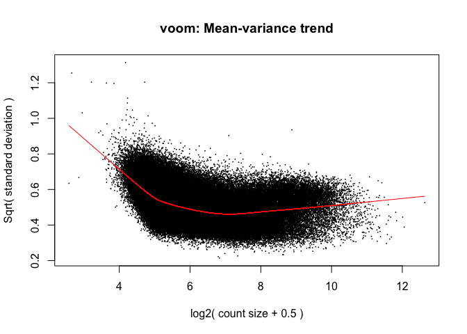<!-- -->

The design matrix, `design`, is used by `voom()` to compute the
observational-level weights (`elist$weights`) but not to compute the
numeric matrix of normalised expression values on the log2 scale
(`elist$E`).

### Checking for batch effects

Let’s look at the data using an MDS plot of the voom-transformed data.

``` r
plotMDS(elist,
        top = 500,
        labels = paste0(elist$targets$DONOR, "-", elist$targets$TISSUE),
        col = elist$targets$NEUN_COLOR,
        gene.selection = "common", 
        main = "top = 500")
legend("bottom",
       legend = unique(elist$targets$NEUN),
       col = unique(elist$targets$NEUN_COLOR),
       pch = 16)
```

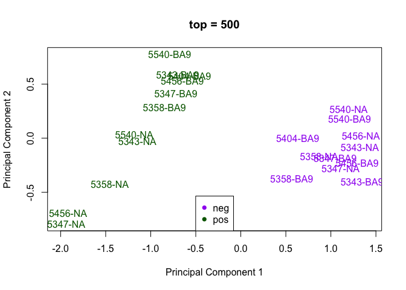<!-- -->

**NOTE:** The above uses the default of `top = 500`, which means that
only the top 500 peaks are used to form the MDS plot. Instead, if we
could use the top 2.5% of peaks to calculate pairwise distances; this is
approximately what is the default for a gene expression analysis in
human `500 / number_of_genes = 500 / 20000`

``` r
plotMDS(elist,
        top = ceiling(0.025 * nrow(elist)),
        labels = paste0(elist$targets$DONOR, "-", elist$targets$TISSUE),
        col = elist$targets$NEUN_COLOR,
        gene.selection = "common", 
        main = "top = 2.5%")
legend("bottom",
       legend = unique(elist$targets$NEUN),
       col = unique(elist$targets$NEUN_COLOR),
       pch = 16)
```

<!-- -->

We have good separation of NeuN+ cells (`pos`) and NeuN- cells (`neg`)
along PC1. However, we also have some clustering by `DONOR` on PC2,
which is stronger than any clustering by `TISSUE:NEUN` along the same
axis (more evidence in the `top = 500` plot)

Our blocking factor, `DONOR`, may be thought of as a ‘batch effect’; we
can see the effect of ‘removing’ `DONOR` by using
`limma::removeBatchEffect()` in combination with `limma::plotMDS()`:

``` r
design_without_donor <- model.matrix(~ 0 + TISSUE_NEUN, elist$targets)
colnames(design_without_donor) <- gsub("TISSUE_NEUN", "",
                                       colnames(design_without_donor))

plotMDS(removeBatchEffect(x = elist,
                          batch = elist$targets$DONOR,
                          design = design_without_donor),
        top = 500,
        labels = paste0(elist$targets$DONOR, "-", elist$targets$TISSUE),
        col = elist$targets$NEUN_COLOR,
        gene.selection = "common",
        main = "Effect of blocking on DONOR (top = 500)")
legend("top",
       legend = unique(elist$targets$NEUN),
       col = unique(elist$targets$NEUN_COLOR),
       pch = 16)
```

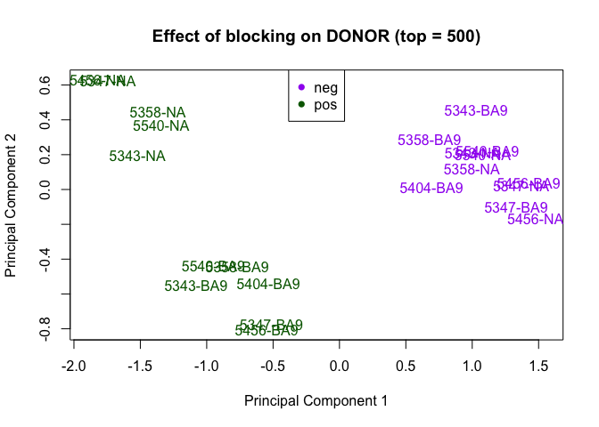<!-- -->

``` r

plotMDS(removeBatchEffect(x = elist,
                          batch = elist$targets$DONOR,
                          design = design_without_donor),
        top = ceiling(0.025 * nrow(elist)),
        labels = paste0(elist$targets$DONOR, "-", elist$targets$TISSUE),
        col = elist$targets$NEUN_COLOR,
        gene.selection = "common",
        main = "Effect of blocking on DONOR (top = 2.5%)")
legend("top",
       legend = unique(elist$targets$NEUN),
       col = unique(elist$targets$NEUN_COLOR),
       pch = 16)
```

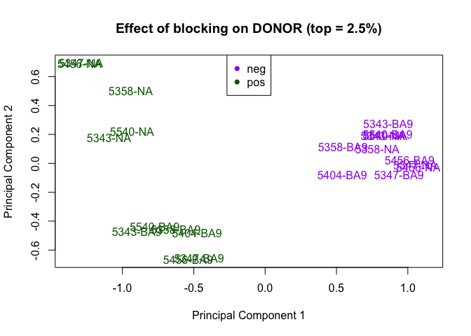<!-- -->

In the updated plot, we retain the good separation of `pos` from `neg`
while improving our clustering by region (`NA` and `BA9`), more so in
the `pos` samples than the `neg` samples (see lower right of plot where
`5456-NA-neg` and `5347-BA9-neg` overlap).

We run [**sva**](http://bioconductor.org/packages/sva/) to check for any
additional batch effects.

### SVA

Note that **sva** just uses `elist$E` because it does not incorporate
the observational-level weights computed by `voom()`.

We first need to estimate the number of SVs

``` r
n_sv <- num.sv(dat = elist$E,
               mod = elist$design,
               method = "be")
n_sv
#> [1] 4
```

We then estimate these 4 surrogate variables and plot them coloured by a
few key variables to try to understand their potential source.

``` r
design0 <- model.matrix(~ 1 + DONOR, elist$targets)
svs <- sva(dat = elist$E, 
           mod = elist$design,
           mod0 = design0,
           n.sv = n_sv)
#> Number of significant surrogate variables is:  4 
#> Iteration (out of 5 ):1  2  3  4  5
```

#### SV2 vs SV1

``` r
plot(svs$sv[, 1], svs$sv[, 2],
     col = elist$targets$DONOR_COLOR, 
     main = "DONOR",
     pch = 16)
legend("bottomleft", 
       legend = unique(elist$targets$DONOR), 
       col = unique(elist$targets$DONOR_COLOR),  
       pch = 16)
```

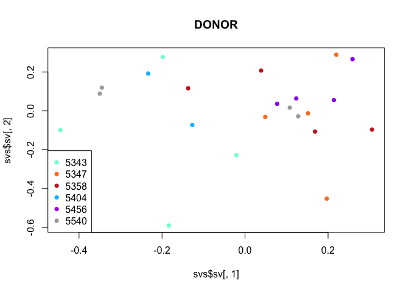<!-- -->

``` r
plot(svs$sv[, 1], svs$sv[, 2], 
     col = elist$targets$TISSUE_COLOR,
     main = "TISSUE",
     pch = 16)
legend("bottomleft", 
       legend = unique(elist$targets$TISSUE), 
       col = unique(elist$targets$TISSUE_COLOR),  
       pch = 16)
```

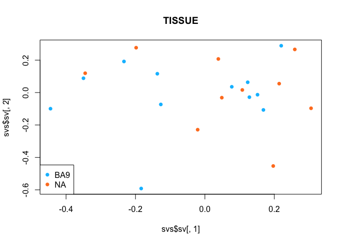<!-- -->

``` r
plot(svs$sv[, 1], svs$sv[, 2],
     col = elist$targets$NEUN_COLOR,
     main = "NEUN",
     pch = 16)
legend("bottomleft", 
       legend = unique(elist$targets$NEUN), 
       col = unique(elist$targets$NEUN_COLOR),  
       pch = 16)
```

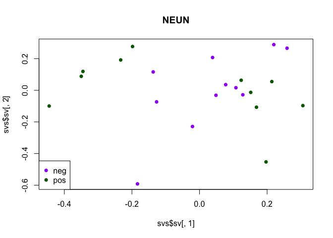<!-- -->

``` r
plot(svs$sv[, 1], svs$sv[, 2],
     col = as.numeric(elist$targets$FLOW_DATE),
     main = "FLOW_DATE",
     pch = 16)
legend("bottomleft", 
       legend = unique(elist$targets$FLOW_DATE), 
       col = unique(as.numeric(elist$targets$FLOW_DATE)),  
       pch = 16)
```

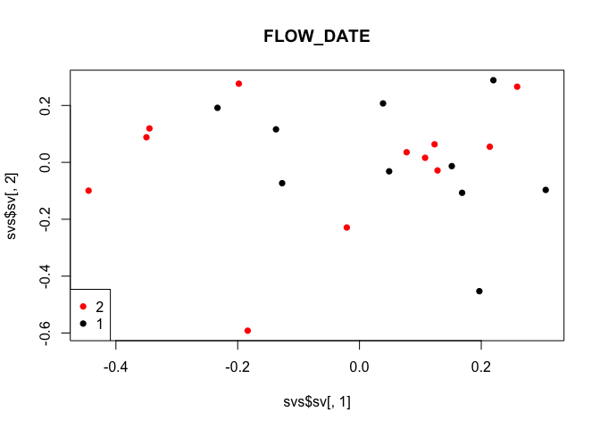<!-- -->

#### SV3 vs SV2

``` r
plot(svs$sv[, 2], svs$sv[, 3],
     col = elist$targets$DONOR_COLOR, 
     main = "DONOR",
     pch = 16)
legend("topleft", 
       legend = unique(elist$targets$DONOR), 
       col = unique(elist$targets$DONOR_COLOR),  
       pch = 16)
```

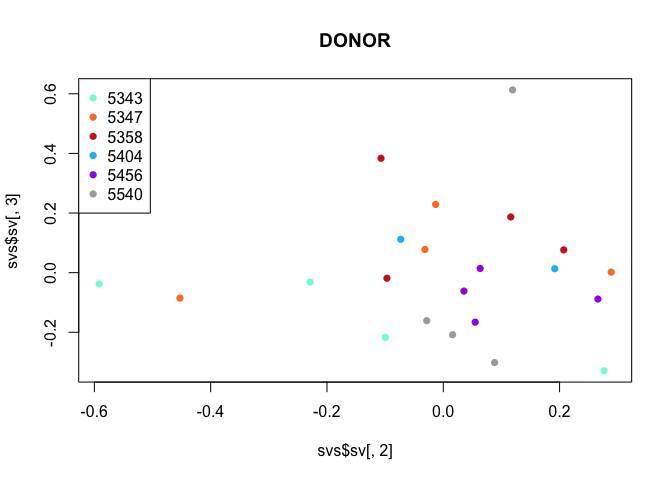<!-- -->

``` r
plot(svs$sv[, 2], svs$sv[, 3], 
     col = elist$targets$TISSUE_COLOR,
     main = "TISSUE",
     pch = 16)
legend("topleft", 
       legend = unique(elist$targets$TISSUE), 
       col = unique(elist$targets$TISSUE_COLOR),  
       pch = 16)
```

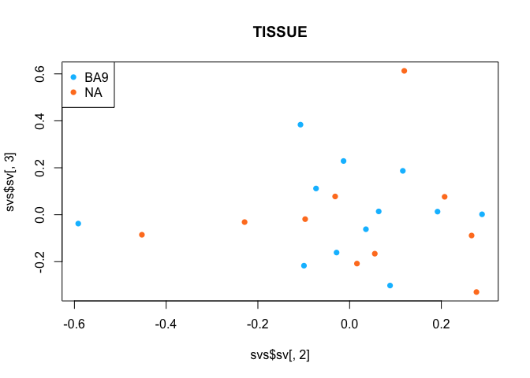<!-- -->

``` r
plot(svs$sv[, 2], svs$sv[, 3],
     col = elist$targets$NEUN_COLOR,
     main = "NEUN")
legend("topleft", 
       legend = unique(elist$targets$NEUN), 
       col = unique(elist$targets$NEUN_COLOR),  
       pch = 16)
```

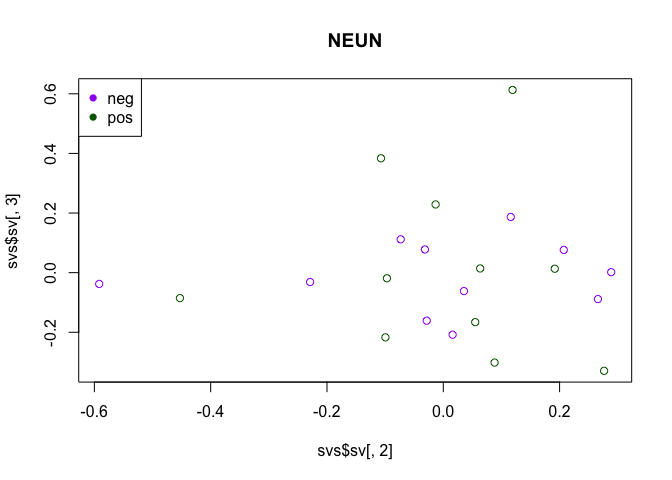<!-- -->

``` r
plot(svs$sv[, 2], svs$sv[, 3],
     col = as.numeric(elist$targets$FLOW_DATE),
     main = "FLOW_DATE",
     pch = 16)
legend("topleft", 
       legend = unique(elist$targets$FLOW_DATE), 
       col = unique(as.numeric(elist$targets$FLOW_DATE)),  
       pch = 16)
```

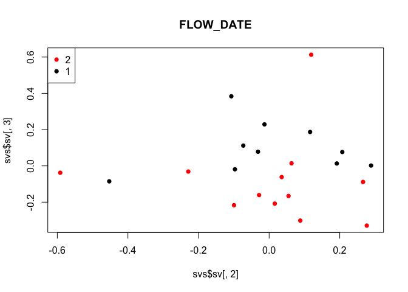<!-- -->

#### SV4 vs SV3

``` r
plot(svs$sv[, 3], svs$sv[, 4],
     col = elist$targets$DONOR_COLOR, 
     main = "DONOR",
     pch = 16)
legend("bottomright", 
       legend = unique(elist$targets$DONOR), 
       col = unique(elist$targets$DONOR_COLOR),  
       pch = 16)
```

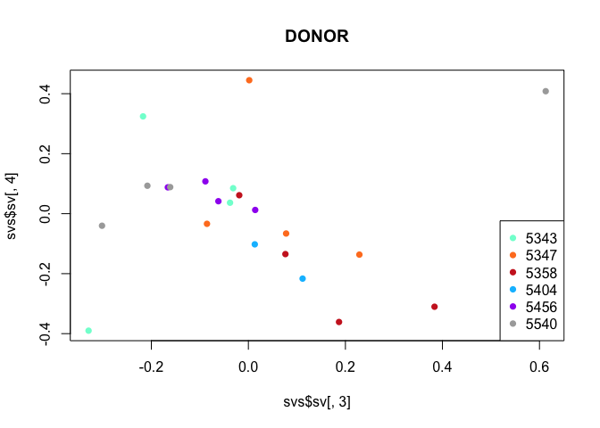<!-- -->

``` r
plot(svs$sv[, 3], svs$sv[, 4],
     col = elist$targets$TISSUE_COLOR,
     main = "TISSUE",
     pch = 16)
legend("bottomright", 
       legend = unique(elist$targets$TISSUE), 
       col = unique(elist$targets$TISSUE_COLOR),  
       pch = 16)
```

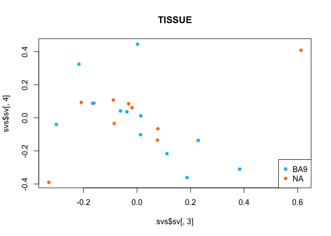<!-- -->

``` r
plot(svs$sv[, 3], svs$sv[, 4],
     col = elist$targets$NEUN_COLOR,
     main = "NEUN",
     pch = 16)
legend("bottomright", 
       legend = unique(elist$targets$NEUN), 
       col = unique(elist$targets$NEUN_COLOR),  
       pch = 16)
```

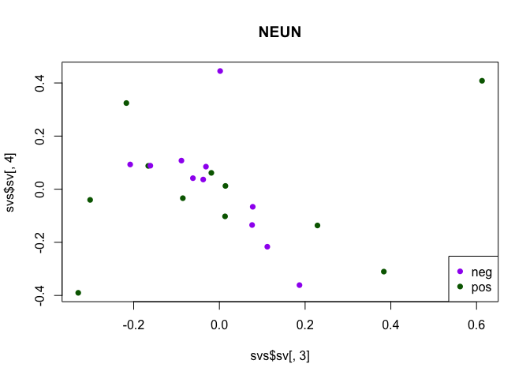<!-- -->

``` r
plot(svs$sv[, 3], svs$sv[, 4],
     col = as.numeric(elist$targets$FLOW_DATE),
     main = "FLOW_DATE",
     pch = 16)
legend("bottomright", 
       legend = unique(elist$targets$FLOW_DATE), 
       col = unique(as.numeric(elist$targets$FLOW_DATE)),  
       pch = 16)
```

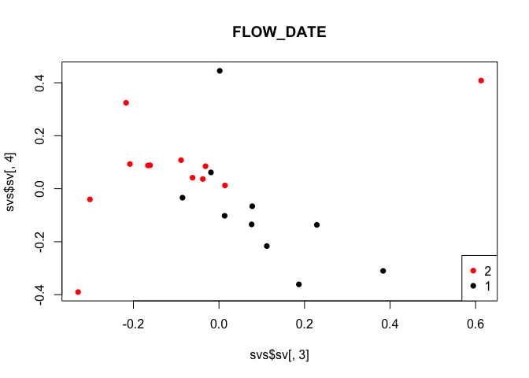<!-- -->

#### SVA summary

Compared to the RNA-seq data, it is less obvious what is driving the
SVs. We ultimately decided to include all 4 SVs in the design matrix.

``` r
design_with_sv <- model.matrix(~ 0 + TISSUE_NEUN + DONOR + svs$sv, 
                               elist$targets)
colnames(design_with_sv) <- gsub("svs\\$", "", 
                                 gsub("TISSUE_NEUN", "", 
                                      colnames(design_with_sv)))
design_with_sv
#>                   BA9_neg BA9_pos NA_neg NA_pos DONOR5347 DONOR5358
#> 5343-BA9-neg.rep1       1       0      0      0         0         0
#> 5343-BA9-pos.rep1       0       1      0      0         0         0
#> 5343-NA-neg.rep1        0       0      1      0         0         0
#> 5343-NA-pos.rep1        0       0      0      1         0         0
#> 5347-BA9-neg.rep1       1       0      0      0         1         0
#> 5347-BA9-pos.rep1       0       1      0      0         1         0
#> 5347-NA-neg.rep1        0       0      1      0         1         0
#> 5347-NA-pos.rep1        0       0      0      1         1         0
#> 5358-BA9-neg.rep1       1       0      0      0         0         1
#> 5358-BA9-pos.rep1       0       1      0      0         0         1
#> 5358-NA-neg.rep1        0       0      1      0         0         1
#> 5358-NA-pos.rep1        0       0      0      1         0         1
#> 5404-BA9-neg.rep1       1       0      0      0         0         0
#> 5404-BA9-pos.rep1       0       1      0      0         0         0
#> 5456-BA9-neg.rep1       1       0      0      0         0         0
#> 5456-BA9-pos.rep1       0       1      0      0         0         0
#> 5456-NA-neg.rep1        0       0      1      0         0         0
#> 5456-NA-pos.rep1        0       0      0      1         0         0
#> 5540-BA9-neg.rep1       1       0      0      0         0         0
#> 5540-BA9-pos.rep1       0       1      0      0         0         0
#> 5540-NA-neg.rep1        0       0      1      0         0         0
#> 5540-NA-pos.rep1        0       0      0      1         0         0
#>                   DONOR5404 DONOR5456 DONOR5540         sv1         sv2
#> 5343-BA9-neg.rep1         0         0         0 -0.18357515 -0.59169382
#> 5343-BA9-pos.rep1         0         0         0 -0.44490421 -0.09951038
#> 5343-NA-neg.rep1          0         0         0 -0.02083623 -0.22897668
#> 5343-NA-pos.rep1          0         0         0 -0.19813148  0.27654421
#> 5347-BA9-neg.rep1         0         0         0  0.21986876  0.28875331
#> 5347-BA9-pos.rep1         0         0         0  0.15157803 -0.01321238
#> 5347-NA-neg.rep1          0         0         0  0.04869892 -0.03153294
#> 5347-NA-pos.rep1          0         0         0  0.19684109 -0.45286974
#> 5358-BA9-neg.rep1         0         0         0 -0.13710110  0.11602497
#> 5358-BA9-pos.rep1         0         0         0  0.16852624 -0.10709197
#> 5358-NA-neg.rep1          0         0         0  0.03867116  0.20717422
#> 5358-NA-pos.rep1          0         0         0  0.30582831 -0.09692152
#> 5404-BA9-neg.rep1         1         0         0 -0.12703268 -0.07321331
#> 5404-BA9-pos.rep1         1         0         0 -0.23317962  0.19169186
#> 5456-BA9-neg.rep1         0         1         0  0.07740171  0.03555441
#> 5456-BA9-pos.rep1         0         1         0  0.12330774  0.06344509
#> 5456-NA-neg.rep1          0         1         0  0.25896343  0.26597343
#> 5456-NA-pos.rep1          0         1         0  0.21399292  0.05491135
#> 5540-BA9-neg.rep1         0         0         1  0.12816106 -0.02847115
#> 5540-BA9-pos.rep1         0         0         1 -0.34988136  0.08821931
#> 5540-NA-neg.rep1          0         0         1  0.10775863  0.01602655
#> 5540-NA-pos.rep1          0         0         1 -0.34495615  0.11917516
#>                            sv3         sv4
#> 5343-BA9-neg.rep1 -0.037792412  0.03650462
#> 5343-BA9-pos.rep1 -0.217078597  0.32434703
#> 5343-NA-neg.rep1  -0.031385119  0.08493803
#> 5343-NA-pos.rep1  -0.329382721 -0.39007863
#> 5347-BA9-neg.rep1  0.001764493  0.44493626
#> 5347-BA9-pos.rep1  0.228804704 -0.13648379
#> 5347-NA-neg.rep1   0.077793111 -0.06613579
#> 5347-NA-pos.rep1  -0.085323034 -0.03382731
#> 5358-BA9-neg.rep1  0.186842538 -0.36112744
#> 5358-BA9-pos.rep1  0.383687320 -0.31025723
#> 5358-NA-neg.rep1   0.076334501 -0.13476102
#> 5358-NA-pos.rep1  -0.018802537  0.06152884
#> 5404-BA9-neg.rep1  0.111775036 -0.21652778
#> 5404-BA9-pos.rep1  0.013204398 -0.10224701
#> 5456-BA9-neg.rep1 -0.061807055  0.04153670
#> 5456-BA9-pos.rep1  0.014068429  0.01238597
#> 5456-NA-neg.rep1  -0.088594441  0.10771851
#> 5456-NA-pos.rep1  -0.166010603  0.08783957
#> 5540-BA9-neg.rep1 -0.161141530  0.08853064
#> 5540-BA9-pos.rep1 -0.301656688 -0.04022225
#> 5540-NA-neg.rep1  -0.208154775  0.09312041
#> 5540-NA-pos.rep1   0.612854983  0.40828170
#> attr(,"assign")
#>  [1] 1 1 1 1 2 2 2 2 2 3 3 3 3
#> attr(,"contrasts")
#> attr(,"contrasts")$TISSUE_NEUN
#> [1] "contr.treatment"
#> 
#> attr(,"contrasts")$DONOR
#> [1] "contr.treatment"
elist_with_sv <- voom(counts = dgelist, design = design_with_sv, plot = TRUE)
```

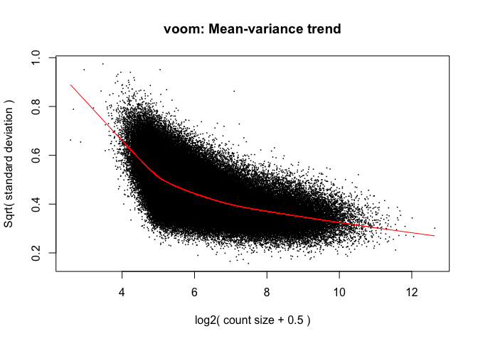<!-- -->

This leaves us with 9 degrees of freedom with which to estimate the
residual variation.

### Contrasts

The conditions we are want to compare are:

1.  `NA_posvsBA9_pos` differential accessibility between NA and BA9 in
    Neun+ cells
2.  `NA_negvsBA9_neg` differential accessibility between NA and BA9 in
    NeuN- cells
3.  `ave_pos_vs_ave_neg` differential accessibility between NeuN+ cells
    and NeuN- cells (each averaged over region).

<!-- end list -->

``` r
contrasts <- makeContrasts(
  "NA_posvsBA9_pos" = NA_pos - BA9_pos,
  "NA_negvsBA9_neg" = NA_neg - BA9_neg,
  "ave_pos_vs_ave_neg" = (NA_pos + BA9_pos) / 2 - (NA_neg + BA9_neg) / 2,
  levels = elist_with_sv$design
)
contrasts
#>            Contrasts
#> Levels      NA_posvsBA9_pos NA_negvsBA9_neg ave_pos_vs_ave_neg
#>   BA9_neg                 0              -1               -0.5
#>   BA9_pos                -1               0                0.5
#>   NA_neg                  0               1               -0.5
#>   NA_pos                  1               0                0.5
#>   DONOR5347               0               0                0.0
#>   DONOR5358               0               0                0.0
#>   DONOR5404               0               0                0.0
#>   DONOR5456               0               0                0.0
#>   DONOR5540               0               0                0.0
#>   sv1                     0               0                0.0
#>   sv2                     0               0                0.0
#>   sv3                     0               0                0.0
#>   sv4                     0               0                0.0
```

### Linear modelling

We are now ready to fit the linear models to the data and to test for DE

``` r
fit_with_sv <- lmFit(object = elist_with_sv, 
                     design = elist_with_sv$design)
fit_with_sv <- contrasts.fit(fit_with_sv, contrasts)
fit_with_sv <- eBayes(fit_with_sv)
```

We summarise the number of differentially accessible regions in each
comparison

``` r
results_with_sv <- decideTests(fit_with_sv)
summary(results_with_sv)
#>        NA_posvsBA9_pos NA_negvsBA9_neg ave_pos_vs_ave_neg
#> Down             33168               5              74069
#> NotSig          215791          283799             120786
#> Up               34853               8              88957
vennDiagram(results_with_sv)
```

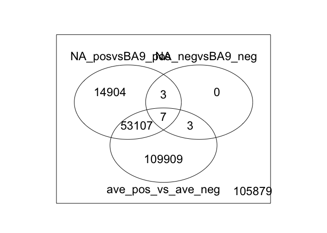<!-- -->

This is consistent with what we expect: lots of differential
accessibility between NeuN+ and NeuN- cells, lots of differential
accessibility in NeuN+ cells between NAcc and BA9, and almost no DE
genes in NeuN- cells between NAcc and BA9.

### Mean-difference plots

Let’s take a look at the mean-difference plot (aka MA plot) for each
comparison. In each plot the peaks highlighted have an adjusted P-value
\< 0.05 and a |logFC| \> 1.

``` r
plotMD(fit_with_sv, column = 1, 
       status = ifelse(
         topTable(fit_with_sv, coef = 1, n = Inf, 
                  sort.by = "none")$adj.P.Val < 0.05, 
         "DAR", "Non-DAR"), 
       hl.col = alpha("orange", 0.1), 
       legend = "bottomright")
```

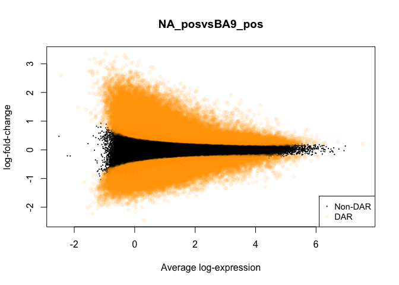<!-- -->

``` r
plotMD(fit_with_sv, column = 2, 
       status = ifelse(
         topTable(fit_with_sv, coef = 2, n = Inf, 
                  sort.by = "none")$adj.P.Val < 0.05, 
         "DAR", "Non-DAR"), 
       hl.col = alpha("orange", 0.3),
       legend = "bottomright")
```

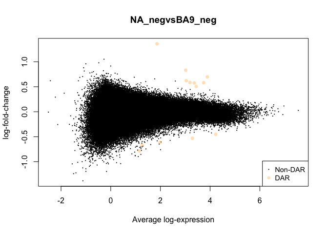<!-- -->

``` r
plotMD(fit_with_sv, column = 3, 
       status = ifelse(
         topTable(fit_with_sv, coef = 3, n = Inf, 
                  sort.by = "none")$adj.P.Val < 0.05, 
         "DAR", "Non-DAR"), 
       hl.col = alpha("orange", 0.3), 
       values = c("DAR"),
       legend = "bottomright")
```

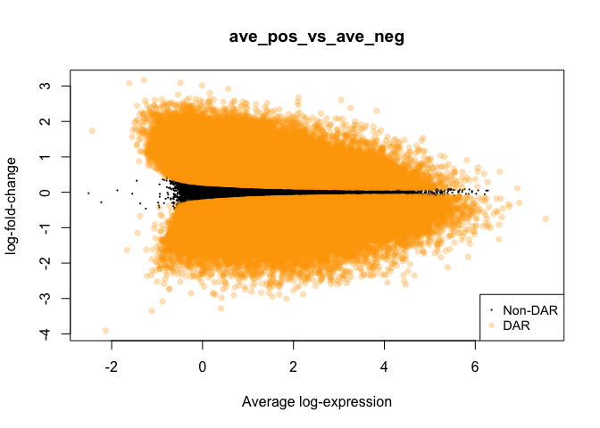<!-- -->

### Writing the differentially accessible peaks list

Finally, write the output of `topTable()`, the table of top
differentially accessibly peaks from the linear model fit, to disk as a
CSV file for the overall F-statistic as well as for each of the
comparisons of interest. Also, save the *MArrayLM* object,
`fit_with_sv`.

**NOTE:** The gene name is the first column although this column is
unnamed in the CSV
file

``` r
# Example of topTable output, looking at top hits ranked by B (log odds of DE)
topTable(fit_with_sv, coef = "NA_posvsBA9_pos")
#>        seqnames     start       end width strand    logFC  AveExpr
#> 686716    chr15  22525883  22528184  2302      * 2.029351 2.035572
#> 82803      chr2  45167774  45172147  4374      * 1.896929 3.188701
#> 528044    chr10  82115322  82118638  3317      * 1.727584 2.725832
#> 70497      chr2   5830058   5834498  4441      * 1.710061 3.512513
#> 81159      chr2  38726585  38728549  1965      * 2.303702 1.516208
#> 70498      chr2   5835651   5837995  2345      * 1.663826 3.047795
#> 116561     chr2 171669090 171675738  6649      * 1.263795 4.116562
#> 82804      chr2  45172901  45181178  8278      * 1.359486 3.824377
#> 613841    chr12  88418582  88420304  1723      * 2.365549 1.106365
#> 742781    chr17  48970265  48971439  1175      * 2.208580 1.639408
#>               t      P.Value    adj.P.Val        B
#> 686716 21.15476 1.355703e-23 3.847648e-18 43.38330
#> 82803  19.39108 3.444376e-22 4.887776e-17 40.39828
#> 528044 18.95599 7.937681e-22 7.509364e-17 39.55848
#> 70497  18.48066 2.011400e-21 1.427149e-16 38.69539
#> 81159  17.90010 6.427090e-21 3.648171e-16 37.28430
#> 70498  16.15003 2.566400e-19 1.117771e-14 33.89703
#> 116561 16.00547 3.526305e-19 1.117771e-14 33.58842
#> 82804  16.00313 3.544578e-19 1.117771e-14 33.58659
#> 613841 16.03329 3.316614e-19 1.117771e-14 33.41182
#> 742781 15.91130 4.342187e-19 1.232365e-14 33.17092

# Write each to disk
coefs <- c(list(NULL), as.list(colnames(fit_with_sv)))
lapply(coefs, function(coef, fit, model) {
  fn <- gzfile(paste0("../extdata/topTable.", ifelse(is.null(coef), "F-stat", 
                                                     coef), 
                      ".ATAC-seq.csv.gz"), 
               open = "w")
  write.csv(x = topTable(fit, coef = coef, n = Inf),
            file = fn, 
            row.names = TRUE,
            quote = FALSE)
  close(fn)
  fn2 <- gzfile(paste0("../extdata/DARs.", ifelse(is.null(coef), "F-stat", 
                                                  coef), 
                       ".ATAC-seq.csv.gz"), 
                open = "w")
  write.csv(x = topTable(fit, coef = coef, n = Inf, p.value = 0.05),
            file = fn2, 
            row.names = TRUE,
            quote = FALSE)
  close(fn2)
  fn3 <- gzfile(paste0("../extdata/DARs_with_logFCgeq1.", 
                       ifelse(is.null(coef), "F-stat", coef), 
                       ".ATAC-seq.csv.gz"), 
                open = "w")
  write.csv(x = topTable(fit, coef = coef, n = Inf, p.value = 0.05, lfc = 2),
            file = fn3, 
            row.names = TRUE,
            quote = FALSE)
  close(fn3)
}, fit = fit_with_sv)
#> [[1]]
#> NULL
#> 
#> [[2]]
#> NULL
#> 
#> [[3]]
#> NULL
#> 
#> [[4]]
#> NULL
saveRDS(fit_with_sv, "../objects/fit_with_sv.rds")
saveRDS(elist_with_sv, "../objects/elist_with_sv.rds")
```

# Session Info

``` r
devtools::session_info()
#> Session info -------------------------------------------------------------
#>  setting  value                                             
#>  version  R Under development (unstable) (2018-03-05 r74359)
#>  system   x86_64, darwin15.6.0                              
#>  ui       X11                                               
#>  language (EN)                                              
#>  collate  en_AU.UTF-8                                       
#>  tz       America/New_York                                  
#>  date     2018-03-20
#> Packages -----------------------------------------------------------------
#>  package              * version    date      
#>  annotate               1.57.2     2017-11-13
#>  AnnotationDbi          1.41.4     2017-12-11
#>  backports              1.1.2      2017-12-13
#>  base                 * 3.5.0      2018-03-06
#>  Biobase              * 2.39.2     2018-01-25
#>  BiocGenerics         * 0.25.3     2018-02-09
#>  BiocParallel         * 1.13.1     2017-12-31
#>  bit                    1.1-12     2014-04-09
#>  bit64                  0.9-7      2017-05-08
#>  bitops                 1.0-6      2013-08-17
#>  blob                   1.1.0      2017-06-17
#>  colorspace             1.3-2      2016-12-14
#>  compiler               3.5.0      2018-03-06
#>  datasets             * 3.5.0      2018-03-06
#>  DBI                    0.8        2018-03-02
#>  DelayedArray         * 0.5.24     2018-03-12
#>  devtools               1.13.5     2018-02-18
#>  digest                 0.6.15     2018-01-28
#>  edgeR                * 3.21.9     2018-02-27
#>  evaluate               0.10.1     2017-06-24
#>  fortunes               1.5-4      2016-12-29
#>  genefilter           * 1.61.1     2018-01-20
#>  GenomeInfoDb         * 1.15.5     2018-02-04
#>  GenomeInfoDbData       1.1.0      2017-12-16
#>  GenomicRanges        * 1.31.22    2018-02-16
#>  graphics             * 3.5.0      2018-03-06
#>  grDevices            * 3.5.0      2018-03-06
#>  grid                   3.5.0      2018-03-06
#>  htmltools              0.3.6      2017-04-28
#>  IRanges              * 2.13.28    2018-02-24
#>  knitr                  1.20       2018-02-20
#>  lattice                0.20-35    2017-03-25
#>  limma                * 3.35.12    2018-02-22
#>  locfit                 1.5-9.1    2013-04-20
#>  magrittr               1.5        2014-11-22
#>  Matrix                 1.2-12     2017-11-20
#>  matrixStats          * 0.53.1     2018-02-11
#>  memoise                1.1.0      2017-04-21
#>  methods              * 3.5.0      2018-03-06
#>  mgcv                 * 1.8-23     2018-01-21
#>  munsell                0.4.3      2016-02-13
#>  nlme                 * 3.1-136    2018-03-09
#>  parallel             * 3.5.0      2018-03-06
#>  pillar                 1.2.1      2018-02-27
#>  plyr                   1.8.4      2016-06-08
#>  Rcpp                   0.12.16    2018-03-13
#>  RCurl                  1.95-4.10  2018-01-04
#>  rlang                  0.2.0.9000 2018-03-12
#>  rmarkdown              1.9        2018-03-01
#>  rprojroot              1.3-2      2018-01-03
#>  RSQLite                2.0        2017-06-19
#>  S4Vectors            * 0.17.37    2018-03-09
#>  scales               * 0.5.0      2017-08-24
#>  splines                3.5.0      2018-03-06
#>  stats                * 3.5.0      2018-03-06
#>  stats4               * 3.5.0      2018-03-06
#>  stringi                1.1.7      2018-03-12
#>  stringr                1.3.0      2018-02-19
#>  SummarizedExperiment * 1.9.15     2018-02-24
#>  survival               2.41-3     2017-04-04
#>  sva                  * 3.27.0     2017-10-31
#>  tibble                 1.4.2      2018-01-22
#>  tools                  3.5.0      2018-03-06
#>  utils                * 3.5.0      2018-03-06
#>  withr                  2.1.2      2018-03-15
#>  XML                    3.98-1.10  2018-02-19
#>  xtable                 1.8-2      2016-02-05
#>  XVector                0.19.9     2018-02-28
#>  yaml                   2.1.18     2018-03-08
#>  zlibbioc               1.25.0     2017-10-31
#>  source                                  
#>  Bioconductor                            
#>  Bioconductor                            
#>  CRAN (R 3.5.0)                          
#>  local                                   
#>  Bioconductor                            
#>  Bioconductor                            
#>  Bioconductor                            
#>  CRAN (R 3.5.0)                          
#>  CRAN (R 3.5.0)                          
#>  CRAN (R 3.5.0)                          
#>  CRAN (R 3.5.0)                          
#>  CRAN (R 3.5.0)                          
#>  local                                   
#>  local                                   
#>  CRAN (R 3.5.0)                          
#>  Github (PeteHaitch/DelayedArray@68efe9e)
#>  CRAN (R 3.5.0)                          
#>  CRAN (R 3.5.0)                          
#>  Bioconductor                            
#>  CRAN (R 3.5.0)                          
#>  CRAN (R 3.5.0)                          
#>  Bioconductor                            
#>  Bioconductor                            
#>  Bioconductor                            
#>  Bioconductor                            
#>  local                                   
#>  local                                   
#>  local                                   
#>  CRAN (R 3.5.0)                          
#>  Bioconductor                            
#>  CRAN (R 3.5.0)                          
#>  CRAN (R 3.5.0)                          
#>  Bioconductor                            
#>  CRAN (R 3.5.0)                          
#>  CRAN (R 3.5.0)                          
#>  CRAN (R 3.5.0)                          
#>  CRAN (R 3.5.0)                          
#>  CRAN (R 3.5.0)                          
#>  local                                   
#>  CRAN (R 3.5.0)                          
#>  CRAN (R 3.5.0)                          
#>  CRAN (R 3.5.0)                          
#>  local                                   
#>  CRAN (R 3.5.0)                          
#>  CRAN (R 3.5.0)                          
#>  CRAN (R 3.5.0)                          
#>  CRAN (R 3.5.0)                          
#>  Github (tidyverse/rlang@ad9b886)        
#>  CRAN (R 3.5.0)                          
#>  CRAN (R 3.5.0)                          
#>  CRAN (R 3.5.0)                          
#>  cran (@0.17.37)                         
#>  CRAN (R 3.5.0)                          
#>  local                                   
#>  local                                   
#>  local                                   
#>  CRAN (R 3.5.0)                          
#>  CRAN (R 3.5.0)                          
#>  Bioconductor                            
#>  CRAN (R 3.5.0)                          
#>  Bioconductor                            
#>  CRAN (R 3.5.0)                          
#>  local                                   
#>  local                                   
#>  CRAN (R 3.5.0)                          
#>  CRAN (R 3.5.0)                          
#>  CRAN (R 3.5.0)                          
#>  Bioconductor                            
#>  CRAN (R 3.5.0)                          
#>  Bioconductor
```
