Voom analysis of flow sorted brain RNA-seq gene-level
================
Peter Hickey
25 October 2016

-   [Summary](#summary)
    -   [Deliverables](#deliverables)
-   [Full analysis](#full-analysis)
    -   [Load packages](#load-packages)
    -   [Load data and construct a *DGEList* object of normalised counts](#load-data-and-construct-a-dgelist-object-of-normalised-counts)
    -   [Including `DONOR` in the design matrix](#including-donor-in-the-design-matrix)
    -   [Incorporating `DONOR` as a random effect](#incorporating-donor-as-a-random-effect)

Summary
=======

We used [**Salmon**](https://github.com/COMBINE-lab/salmon) to quasi-map and quantify the 20 RNA-seq libraries again GENCODE v19 (protein coding transcripts and long non-coding RNA transcripts). We computed normalised gene-level counts from abundances (scaled using the average transcript length over samples and the library size) using [**tximport**](https://bioconductor.org/packages/release/bioc/html/tximport.html). Only genes with more than 1 count per million (cpm) in at least 4 libraries (the size of the smallest group of samples) were retained for downstream analysis. Only autosomal genes are retained.

We then used `limma::voom()` to convert these normalised counts to *l**o**g*<sub>2</sub>-cpm, with associated weights, ready for linear modelling. The design matrix included additive terms for `DONOR` and `TISSUE_NEUN` (`~ 0 + TISSUE_NEUN + DONOR`), i.e. we block on `DONOR`.

We ran [**sva**](https://bioconductor.org/packages/release/bioc/html/sva.html) and identified 4 SVs. The first 2 SVs appears to be associated with `FLOW_DATE`, the date of flow sorting (3 `DONOR`s sorted one day, 3 `DONOR`s another), and the second SV with `NEUN` (even though we include this in the design matrix). We don't have see any obvious variables associated with SVs 3 and 4.

We tested for differential expression between:

1.  `NA_pos` and `BA_pos` (`NA_posvsBA9_pos`)
2.  `NA_neg` and `BA_neg` (`NA_negvsBA9_neg`)
3.  `(NA_pos + BA9_pos) / 2` and `(NA_neg + BA9_neg) / 2` (`ave_pos_vs_ave_neg`)

Deliverables
------------

<table>
<colgroup>
<col width="25%" />
<col width="25%" />
<col width="25%" />
<col width="25%" />
</colgroup>
<thead>
<tr class="header">
<th>Comparison</th>
<th>CSV of <code>topTable()</code> output for all genes</th>
<th>CSV of DE genes (DEGs)</th>
<th>Mean-difference plot (.png)</th>
</tr>
</thead>
<tbody>
<tr class="odd">
<td>NA_posvsBA9_pos</td>
<td><a href="../extdata/topTable.NA_posvsBA9_pos.RNA-seq.csv.gz"><code>../extdata/topTable.NA_posvsBA9_pos.RNA-seq.csv.gz</code></a></td>
<td><a href="../extdata/DEGs.NA_posvsBA9_pos.RNA-seq.csv.gz"><code>../extdata/DEGs.NA_posvsBA9_pos.RNA-seq.csv.gz</code></a></td>
<td><a href="voom-flow-sorted-brain-rna-seq_files/figure-markdown_github/NA_posvsBA9_pos.MD-plot-1.png"><code>voom-flow-sorted-brain-rna-seq_files/figure-markdown_github/NA_posvsBA9_pos.MD-plot-1.png</code></a></td>
</tr>
<tr class="even">
<td>NA_negvsBA9_neg</td>
<td><a href="../extdata/topTable.NA_negvsBA9_neg.RNA-seq.csv.gz"><code>../extdata/topTable.NA_negvsBA9_neg.RNA-seq.csv.gz</code></a></td>
<td><a href="../extdata/DEGs.NA_negvsBA9_neg.RNA-seq.csv.gz"><code>../extdata/DEGs.NA_negvsBA9_neg.RNA-seq.csv.gz</code></a></td>
<td><a href="voom-flow-sorted-brain-rna-seq_files/figure-markdown_github/NA_negvsBA9_neg.MD-plot-1.png"><code>voom-flow-sorted-brain-rna-seq_files/figure-markdown_github/NA_negvsBA9_neg.MD-plot-1.png</code></a></td>
</tr>
<tr class="odd">
<td>ave_pos_vs_ave_neg</td>
<td><a href="../extdata/topTable.ave_pos_vs_ave_neg.RNA-seq.csv.gz"><code>../extdata/topTable.ave_pos_vs_ave_neg.RNA-seq.csv.gz</code></a></td>
<td><a href="../extdata/DEGs.ave_pos_vs_ave_neg.RNA-seq.csv.gz"><code>../extdata/DEGs.ave_pos_vs_ave_neg.RNA-seq.csv.gz</code></a></td>
<td><a href="voom-flow-sorted-brain-rna-seq_files/figure-markdown_github/ave_pos_vs_ave_neg.MD-plot-1.png"><code>voom-flow-sorted-brain-rna-seq_files/figure-markdown_github/ave_pos_vs_ave_neg.MD-plot-1.png</code></a></td>
</tr>
</tbody>
</table>

Full analysis
=============

Load packages
-------------

``` r
library(S4Vectors)
library(limma)
library(edgeR)
library(sva)
library(GenomicRanges)
```

Load data and construct a *DGEList* object of normalised counts
---------------------------------------------------------------

Construct a *DGEList* object for use with [**voom**](https://bioconductor.org/packages/voom) from the `txi` object created with [**tximport**](https://bioconductor.org/packages/tximport) in [`../scripts/tximport.R`](../scripts/tximport.R).

**NOTE**: We only retain autosomal genes.

``` r
txi_gene <- readRDS("../objects/txi-gene.flow-sorted-brain-rna-seq.rds")

# Drop non-autosomal genes
load("../../Objects/gencode_features.rda")
txi_gene[1:3] <- lapply(txi_gene[1:3], function(df) {
  df[rownames(df) %in% names(gencode_features$transcripts_by_gene), ]
})

cd <- readRDS("../objects/colData-flow-sorted-brain-rna-seq.rds")
# TODO: Move to make-colData.R
# Add combination of TISSUE and NEUN as its own variable
cd$TISSUE_NEUN <- factor(paste0(cd$TISSUE, "_", cd$NEUN))

stopifnot(identical(colnames(txi_gene$counts), rownames(cd)))

# Construct DGEList
dgelist <- DGEList(txi_gene$counts, samples = cd)
dim(dgelist)
#> [1] 33351    20
```

**IMPORTANT:** The `dgelist` object contains counts at the *gene* level; `rownames(dgelist)` are GENCODE `gene_id` of the form `ENSGXXXXXXXXXXX.X`; the `.X` suffix indicates the gene *version number* (<http://www.gencodegenes.org/data_format.html>)

``` r
head(rownames(dgelist))
#> [1] "ENSG00000000419.8"  "ENSG00000000457.9"  "ENSG00000000460.12"
#> [4] "ENSG00000000938.8"  "ENSG00000000971.11" "ENSG00000001036.9"
```

### Filter out lowly expressed genes

[Gordon says](https://stat.ethz.ch/pipermail/bioconductor/2012-September/047995.html):

> Note that our recommended filtering is `keep <- rowSums(cpm(dge) > k) >= X`, where `X` is the sample size of the smallest group size ... You are also free to vary k, depending on your sequencing depth.

Our smallest group size is 4 and we explore a range of `k`

``` r
# Group sizes
xtabs(~ TISSUE + NEUN, dgelist$samples)
#>       NEUN
#> TISSUE neg pos
#>    BA9   5   6
#>    NA    4   5

# Vary k from -1 (no filtering) to k = 5
sapply(-1:5, function(k) sum(rowSums(cpm(dgelist) > k) >= 4))
#> [1] 33351 31332 24161 21462 19809 18489 17431
```

We'll err on the inclusive side and set `k = 1` (as is used in Section 18.2.7 of the limma user's guide), keeping 72% of genes.

``` r
keep <- rowSums(cpm(dgelist) > 1) >= 4
dgelist <- dgelist[keep, ]
dim(dgelist)
#> [1] 24161    20
```

Next, perform TMM normalisation

``` r
dgelist <- calcNormFactors(dgelist)
```

We now have normalised counts generated from abundances (scaled using the average transcript length over samples and the library size) in a *DGEList*.

Including `DONOR` in the design matrix
--------------------------------------

### Design matrix

At this point, we need to specify design matrix. We have an unbalanced design with 20 RNA-seq libraries from 6 donors in 4 conditions

``` r
xtabs(~ DONOR + TISSUE_NEUN, dgelist$samples)
#>       TISSUE_NEUN
#> DONOR  BA9_neg BA9_pos NA_neg NA_pos
#>   5343       1       1      1      1
#>   5347       1       1      1      1
#>   5358       0       1      0      1
#>   5404       1       1      0      0
#>   5456       1       1      1      1
#>   5540       1       1      1      1
```

We have (mostly) the same 6 donors in all 4 conditions, so we block on `DONOR` to make all subsequent comparisons 'within `DONOR`'.

``` r
design <- model.matrix(~ 0 + TISSUE_NEUN + DONOR, dgelist$samples)
colnames(design) <- gsub("TISSUE_NEUN", "", colnames(design))
design
#>                   BA9_neg BA9_pos NA_neg NA_pos DONOR5347 DONOR5358
#> 5540-BA9-neg.rep1       1       0      0      0         0         0
#> 5540-BA9-pos.rep1       0       1      0      0         0         0
#> 5540-NA-neg.rep1        0       0      1      0         0         0
#> 5540-NA-pos.rep1        0       0      0      1         0         0
#> 5456-BA9-neg.rep1       1       0      0      0         0         0
#> 5456-BA9-pos.rep1       0       1      0      0         0         0
#> 5456-NA-neg.rep1        0       0      1      0         0         0
#> 5456-NA-pos.rep1        0       0      0      1         0         0
#> 5343-BA9-neg.rep1       1       0      0      0         0         0
#> 5343-BA9-pos.rep1       0       1      0      0         0         0
#> 5343-NA-neg.rep1        0       0      1      0         0         0
#> 5343-NA-pos.rep1        0       0      0      1         0         0
#> 5358-BA9-pos.rep1       0       1      0      0         0         1
#> 5358-NA-pos.rep1        0       0      0      1         0         1
#> 5404-BA9-neg.rep1       1       0      0      0         0         0
#> 5404-BA9-pos.rep1       0       1      0      0         0         0
#> 5347-NA-neg.rep1        0       0      1      0         1         0
#> 5347-NA-pos.rep1        0       0      0      1         1         0
#> 5347-BA9-neg.rep1       1       0      0      0         1         0
#> 5347-BA9-pos.rep1       0       1      0      0         1         0
#>                   DONOR5404 DONOR5456 DONOR5540
#> 5540-BA9-neg.rep1         0         0         1
#> 5540-BA9-pos.rep1         0         0         1
#> 5540-NA-neg.rep1          0         0         1
#> 5540-NA-pos.rep1          0         0         1
#> 5456-BA9-neg.rep1         0         1         0
#> 5456-BA9-pos.rep1         0         1         0
#> 5456-NA-neg.rep1          0         1         0
#> 5456-NA-pos.rep1          0         1         0
#> 5343-BA9-neg.rep1         0         0         0
#> 5343-BA9-pos.rep1         0         0         0
#> 5343-NA-neg.rep1          0         0         0
#> 5343-NA-pos.rep1          0         0         0
#> 5358-BA9-pos.rep1         0         0         0
#> 5358-NA-pos.rep1          0         0         0
#> 5404-BA9-neg.rep1         1         0         0
#> 5404-BA9-pos.rep1         1         0         0
#> 5347-NA-neg.rep1          0         0         0
#> 5347-NA-pos.rep1          0         0         0
#> 5347-BA9-neg.rep1         0         0         0
#> 5347-BA9-pos.rep1         0         0         0
#> attr(,"assign")
#> [1] 1 1 1 1 2 2 2 2 2
#> attr(,"contrasts")
#> attr(,"contrasts")$TISSUE_NEUN
#> [1] "contr.treatment"
#> 
#> attr(,"contrasts")$DONOR
#> [1] "contr.treatment"
```

Under this design matrix, the baseline is donor 5343 (`DONOR5343`).

### Transformation with `limma::voom()`

We use `limma::voom()` to convert these normalised counts to *l**o**g*<sub>2</sub>-cpm, with associated weights, ready for linear modelling.

``` r
elist <- voom(counts = dgelist, design = design, plot = TRUE)
```

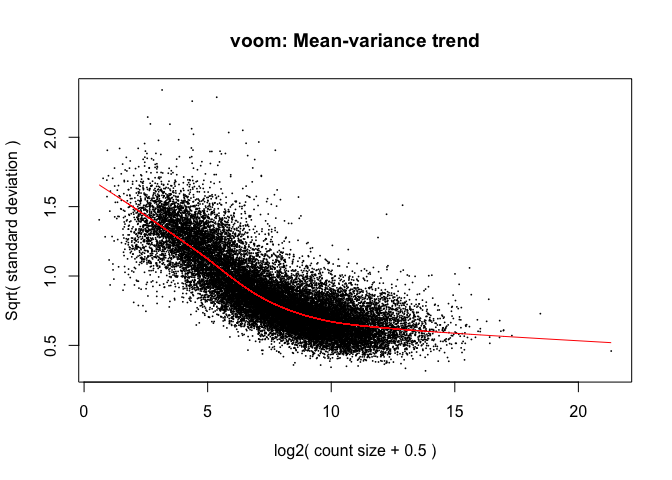

The design matrix, `design`, is used by `voom()` to compute the observational-level weights (`elist$weights`) but not to compute the numeric matrix of normalised expression values on the log2 scale (`elist$E`).

### Checking for batch effects

Let's look at the data using an MDS plot of the voom-transformed data.

``` r
plotMDS(elist, 
        top = 500,
        labels = paste0(elist$targets$DONOR, "-", elist$targets$TISSUE), 
        col = elist$targets$NEUN_COLOR, 
        gene.selection = "common")
legend("top", 
       legend = unique(elist$targets$NEUN), 
       col = unique(elist$targets$NEUN_COLOR),  
       pch = 15)
```

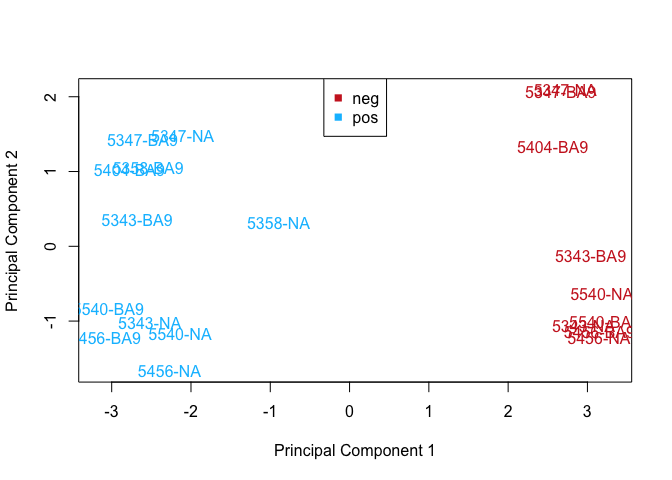

We have good separation of NeuN+ cells (`pos`) and NeuN- cells (`neg`) along PC1. However, it is apparent that we have some clustering by `DONOR` on PC2, which is stronger than any clustering by `TISSUE:NEUN` along the same axis.

Our blocking factor, `DONOR`, may be thought of as a 'batch effect'; we can see the effect of 'removing' `DONOR` by using `limma::removeBatchEffect()` in combination with `limma::plotMDS()`:

``` r
design_without_donor <- model.matrix(~ 0 + TISSUE_NEUN, elist$targets)
colnames(design_without_donor) <- gsub("TISSUE_NEUN", "",
                                       colnames(design_without_donor))
plotMDS(removeBatchEffect(x = elist, 
                          batch = elist$targets$DONOR,
                          design = design_without_donor),
        top = 500,
        labels = paste0(elist$targets$DONOR, "-", elist$targets$TISSUE), 
        col = elist$targets$NEUN_COLOR, 
        gene.selection = "common", 
        main = "Effect of blocking on DONOR", 
        xlim = c(-4, 4))
legend("top", 
       legend = unique(elist$targets$NEUN), 
       col = unique(elist$targets$NEUN_COLOR),  
       pch = 15)
```

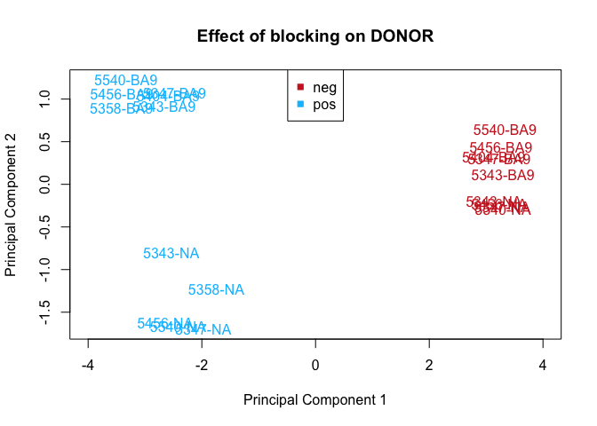

In the updated plot, we retain the good separation of `pos` from `neg` while improving our clustering by region (`NA` and `BA9`).

We run [**sva**](http://bioconductor.org/packages/sva/) to check for any additional batch effects.

### SVA

Note that **sva** just uses `elist$E` because it does not incorporate the observational-level weights computed by `voom()`.

We first need to estimate the number of SVs

``` r
n_sv <- num.sv(dat = elist$E,
               mod = elist$design,
               method = "be")
n_sv
#> [1] 5
```

We then estimate these 5 surrogate variables and plot them coloured by a few key variables to try to understand their potential source.

``` r
design0 <- model.matrix(~ 1 + DONOR, elist$targets)
svs <- sva(dat = elist$E, 
           mod = elist$design,
           mod0 = design0,
           n.sv = n_sv)
#> Number of significant surrogate variables is:  5 
#> Iteration (out of 5 ):1  2  3  4  5
```

#### SV2 vs SV1

``` r
plot(svs$sv[, 1], svs$sv[, 2],
     col = elist$targets$DONOR_COLOR, 
     main = "DONOR")
legend("topright", 
       legend = unique(elist$targets$DONOR), 
       col = unique(elist$targets$DONOR_COLOR),  
       pch = 15)
```

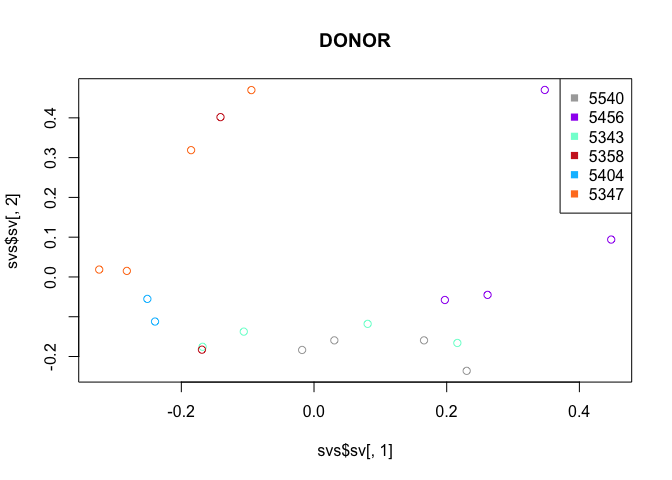

``` r
plot(svs$sv[, 1], svs$sv[, 2], 
     col = elist$targets$TISSUE_COLOR,
     main = "TISSUE")
legend("topright", 
       legend = unique(elist$targets$TISSUE), 
       col = unique(elist$targets$TISSUE_COLOR),  
       pch = 15)
```

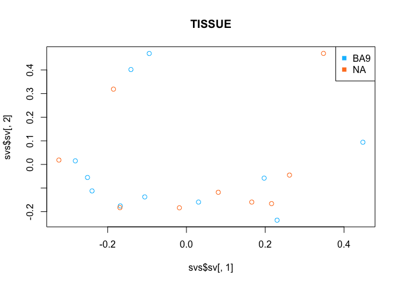

``` r
plot(svs$sv[, 1], svs$sv[, 2],
     col = elist$targets$NEUN_COLOR,
     main = "NEUN")
legend("topright", 
       legend = unique(elist$targets$NEUN), 
       col = unique(elist$targets$NEUN_COLOR),  
       pch = 15)
```

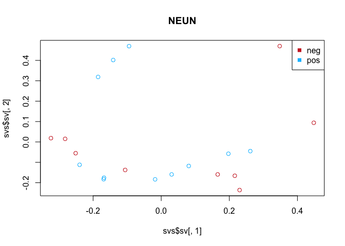

``` r
plot(svs$sv[, 1], svs$sv[, 2],
     col = as.numeric(elist$targets$FLOW_DATE),
     main = "FLOW_DATE")
legend("topright", 
       legend = unique(elist$targets$FLOW_DATE), 
       col = unique(as.numeric(elist$targets$FLOW_DATE)),  
       pch = 15)
```

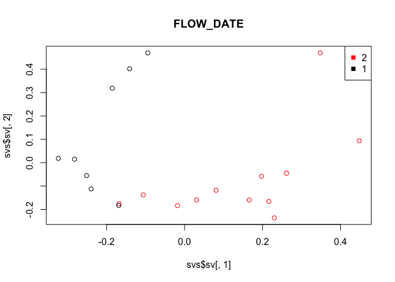

#### SV3 vs SV2

``` r
plot(svs$sv[, 2], svs$sv[, 3],
     col = elist$targets$DONOR_COLOR, 
     main = "DONOR")
legend("topleft", 
       legend = unique(elist$targets$DONOR), 
       col = unique(elist$targets$DONOR_COLOR),  
       pch = 15)
```

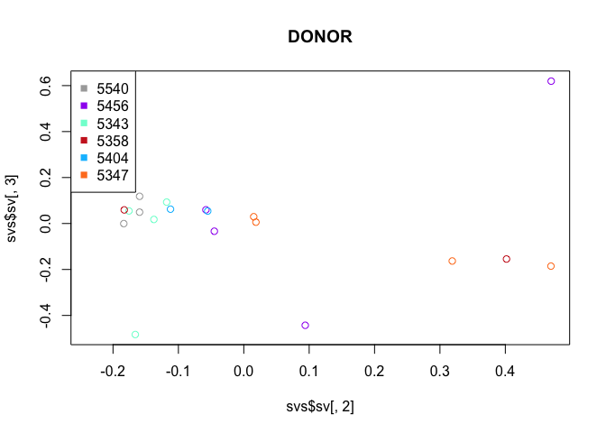

``` r
plot(svs$sv[, 2], svs$sv[, 3], 
     col = elist$targets$TISSUE_COLOR,
     main = "TISSUE")
legend("topleft", 
       legend = unique(elist$targets$TISSUE), 
       col = unique(elist$targets$TISSUE_COLOR),  
       pch = 15)
```

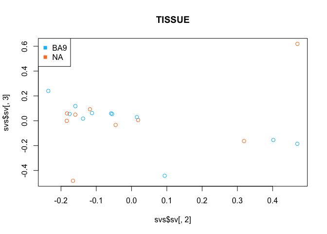

``` r
plot(svs$sv[, 2], svs$sv[, 3],
     col = elist$targets$NEUN_COLOR,
     main = "NEUN")
legend("topleft", 
       legend = unique(elist$targets$NEUN), 
       col = unique(elist$targets$NEUN_COLOR),  
       pch = 15)
```

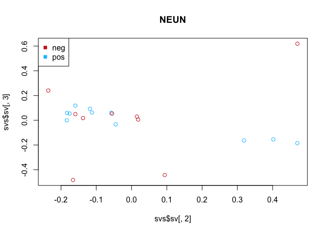

``` r
plot(svs$sv[, 2], svs$sv[, 3],
     col = as.numeric(elist$targets$FLOW_DATE),
     main = "FLOW_DATE")
legend("topleft", 
       legend = unique(elist$targets$FLOW_DATE), 
       col = unique(as.numeric(elist$targets$FLOW_DATE)),  
       pch = 15)
```


#### SV4 vs SV3

``` r
plot(svs$sv[, 3], svs$sv[, 4],
     col = elist$targets$DONOR_COLOR, 
     main = "DONOR")
legend("bottomleft", 
       legend = unique(elist$targets$DONOR), 
       col = unique(elist$targets$DONOR_COLOR),  
       pch = 15)
```

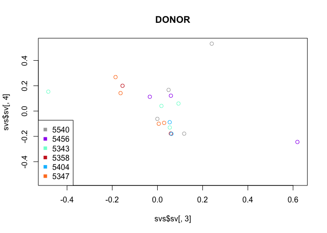

``` r
plot(svs$sv[, 3], svs$sv[, 4],
     col = elist$targets$TISSUE_COLOR,
     main = "TISSUE")
legend("bottomleft", 
       legend = unique(elist$targets$TISSUE), 
       col = unique(elist$targets$TISSUE_COLOR),  
       pch = 15)
```

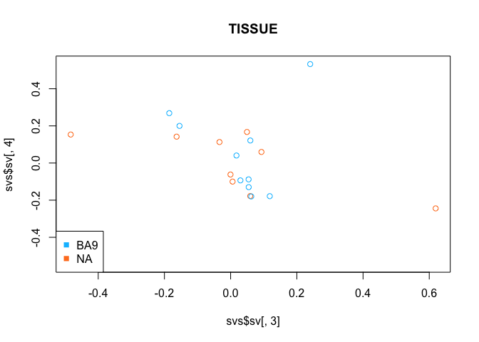

``` r
plot(svs$sv[, 3], svs$sv[, 4],
     col = elist$targets$NEUN_COLOR,
     main = "NEUN")
legend("bottomleft", 
       legend = unique(elist$targets$NEUN), 
       col = unique(elist$targets$NEUN_COLOR),  
       pch = 15)
```

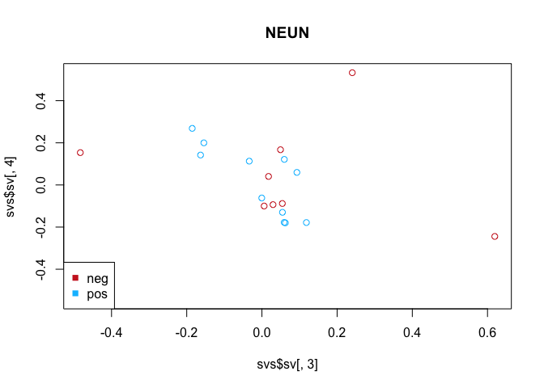

``` r
plot(svs$sv[, 3], svs$sv[, 4],
     col = as.numeric(elist$targets$FLOW_DATE),
     main = "FLOW_DATE")
legend("bottomleft", 
       legend = unique(elist$targets$FLOW_DATE), 
       col = unique(as.numeric(elist$targets$FLOW_DATE)),  
       pch = 15)
```

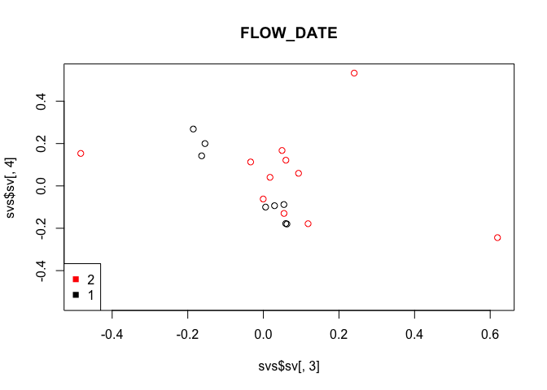

#### SVA summary

There is some association with `FLOW_DATE` along SV1 and SV2 (the RNA for these data were generated from flow sorting experiments over 2 days, with tissue from 3 donors done the first day and tissue from the other 3 donors done the second day).

``` r
xtabs(~ DONOR + FLOW_DATE, elist$targets)
#>       FLOW_DATE
#> DONOR  1 2
#>   5343 0 4
#>   5347 4 0
#>   5358 2 0
#>   5404 2 0
#>   5456 0 4
#>   5540 0 4
```

There is also some association with `NEUN` along SV2 even though we have included this as a factor in the model.

We ultimately decided to include all 5 SVs in the design matrix.

``` r
design_with_sv <- model.matrix(~ 0 + TISSUE_NEUN + DONOR + svs$sv, 
                                elist$targets)
colnames(design_with_sv) <- gsub("svs\\$", "", 
                                  gsub("TISSUE_NEUN", "", 
                                       colnames(design_with_sv)))
design_with_sv
#>                   BA9_neg BA9_pos NA_neg NA_pos DONOR5347 DONOR5358
#> 5540-BA9-neg.rep1       1       0      0      0         0         0
#> 5540-BA9-pos.rep1       0       1      0      0         0         0
#> 5540-NA-neg.rep1        0       0      1      0         0         0
#> 5540-NA-pos.rep1        0       0      0      1         0         0
#> 5456-BA9-neg.rep1       1       0      0      0         0         0
#> 5456-BA9-pos.rep1       0       1      0      0         0         0
#> 5456-NA-neg.rep1        0       0      1      0         0         0
#> 5456-NA-pos.rep1        0       0      0      1         0         0
#> 5343-BA9-neg.rep1       1       0      0      0         0         0
#> 5343-BA9-pos.rep1       0       1      0      0         0         0
#> 5343-NA-neg.rep1        0       0      1      0         0         0
#> 5343-NA-pos.rep1        0       0      0      1         0         0
#> 5358-BA9-pos.rep1       0       1      0      0         0         1
#> 5358-NA-pos.rep1        0       0      0      1         0         1
#> 5404-BA9-neg.rep1       1       0      0      0         0         0
#> 5404-BA9-pos.rep1       0       1      0      0         0         0
#> 5347-NA-neg.rep1        0       0      1      0         1         0
#> 5347-NA-pos.rep1        0       0      0      1         1         0
#> 5347-BA9-neg.rep1       1       0      0      0         1         0
#> 5347-BA9-pos.rep1       0       1      0      0         1         0
#>                   DONOR5404 DONOR5456 DONOR5540         sv1         sv2
#> 5540-BA9-neg.rep1         0         0         1  0.23013617 -0.23603455
#> 5540-BA9-pos.rep1         0         0         1  0.03062930 -0.15936503
#> 5540-NA-neg.rep1          0         0         1  0.16581130 -0.15936111
#> 5540-NA-pos.rep1          0         0         1 -0.01794681 -0.18351946
#> 5456-BA9-neg.rep1         0         1         0  0.44795939  0.09399169
#> 5456-BA9-pos.rep1         0         1         0  0.19725551 -0.05790992
#> 5456-NA-neg.rep1          0         1         0  0.34788578  0.47011219
#> 5456-NA-pos.rep1          0         1         0  0.26159479 -0.04506457
#> 5343-BA9-neg.rep1         0         0         0 -0.10586635 -0.13746205
#> 5343-BA9-pos.rep1         0         0         0 -0.16793137 -0.17561595
#> 5343-NA-neg.rep1          0         0         0  0.21603181 -0.16593537
#> 5343-NA-pos.rep1          0         0         0  0.08083506 -0.11791903
#> 5358-BA9-pos.rep1         0         0         0 -0.14097413  0.40181594
#> 5358-NA-pos.rep1          0         0         0 -0.16892711 -0.18284566
#> 5404-BA9-neg.rep1         1         0         0 -0.25122384 -0.05516763
#> 5404-BA9-pos.rep1         1         0         0 -0.23963699 -0.11210576
#> 5347-NA-neg.rep1          0         0         0 -0.32379710  0.01859407
#> 5347-NA-pos.rep1          0         0         0 -0.18530036  0.31882263
#> 5347-BA9-neg.rep1         0         0         0 -0.28212340  0.01519258
#> 5347-BA9-pos.rep1         0         0         0 -0.09441165  0.46977701
#>                             sv3         sv4          sv5
#> 5540-BA9-neg.rep1  0.2402958576  0.53276650 -0.419109627
#> 5540-BA9-pos.rep1  0.1182545641 -0.17851797 -0.022786952
#> 5540-NA-neg.rep1   0.0493741088  0.16721019  0.698741416
#> 5540-NA-pos.rep1  -0.0004524648 -0.06180639  0.022379342
#> 5456-BA9-neg.rep1 -0.4428591493 -0.54497634 -0.038865091
#> 5456-BA9-pos.rep1  0.0595269743  0.12137376  0.055033129
#> 5456-NA-neg.rep1   0.6193552431 -0.24426835 -0.168570063
#> 5456-NA-pos.rep1  -0.0336761382  0.11306843  0.357283083
#> 5343-BA9-neg.rep1  0.0176129872  0.04052414 -0.006332357
#> 5343-BA9-pos.rep1  0.0545834649 -0.12992058 -0.049775704
#> 5343-NA-neg.rep1  -0.4830876991  0.15346632 -0.374379049
#> 5343-NA-pos.rep1   0.0930566073  0.05960021  0.051676951
#> 5358-BA9-pos.rep1 -0.1544763306  0.19990404  0.025553212
#> 5358-NA-pos.rep1   0.0591606615 -0.17781760 -0.087620678
#> 5404-BA9-neg.rep1  0.0542680887 -0.08796403  0.014002065
#> 5404-BA9-pos.rep1  0.0622756342 -0.17985095 -0.132502896
#> 5347-NA-neg.rep1   0.0058978319 -0.09994694  0.015858263
#> 5347-NA-pos.rep1  -0.1632315535  0.14199511 -0.010728310
#> 5347-BA9-neg.rep1  0.0295214123 -0.09345375  0.045638600
#> 5347-BA9-pos.rep1 -0.1854001004  0.26861419  0.024504666
#> attr(,"assign")
#>  [1] 1 1 1 1 2 2 2 2 2 3 3 3 3 3
#> attr(,"contrasts")
#> attr(,"contrasts")$TISSUE_NEUN
#> [1] "contr.treatment"
#> 
#> attr(,"contrasts")$DONOR
#> [1] "contr.treatment"
elist_with_sv <- voom(counts = dgelist, design = design_with_sv, plot = TRUE)
```


This leaves us with 6 degrees of freedom with which to estimate the residual variation.

### Contrasts

The conditions we are want to compare are:

1.  `NA_posvsBA9_pos` differential expression between NA and BA9 in Neun+ cells
2.  `NA_negvsBA9_neg` differential expression between NA and BA9 in NeuN- cells
3.  `ave_pos_vs_ave_neg` differential expression between NeuN+ cells and NeuN- cells (each averaged over region).

``` r
contrasts <- makeContrasts(
  "NA_posvsBA9_pos" = NA_pos - BA9_pos,
  "NA_negvsBA9_neg" = NA_neg - BA9_neg,
  "ave_pos_vs_ave_neg" = (NA_pos + BA9_pos) / 2 - (NA_neg + BA9_neg) / 2,
  levels = elist_with_sv$design
)
contrasts
#>            Contrasts
#> Levels      NA_posvsBA9_pos NA_negvsBA9_neg ave_pos_vs_ave_neg
#>   BA9_neg                 0              -1               -0.5
#>   BA9_pos                -1               0                0.5
#>   NA_neg                  0               1               -0.5
#>   NA_pos                  1               0                0.5
#>   DONOR5347               0               0                0.0
#>   DONOR5358               0               0                0.0
#>   DONOR5404               0               0                0.0
#>   DONOR5456               0               0                0.0
#>   DONOR5540               0               0                0.0
#>   sv1                     0               0                0.0
#>   sv2                     0               0                0.0
#>   sv3                     0               0                0.0
#>   sv4                     0               0                0.0
#>   sv5                     0               0                0.0
```

### Linear modelling

We are now ready to fit the linear models to the data and to test for DE

``` r
fit_with_sv <- lmFit(object = elist_with_sv, 
                      design = elist_with_sv$design)
fit_with_sv <- contrasts.fit(fit_with_sv, contrasts)
fit_with_sv <- eBayes(fit_with_sv)
```

We summarise the number of DE genes in each comparison

``` r
results_with_sv <- decideTests(fit_with_sv)
summary(results_with_sv)
#>    NA_posvsBA9_pos NA_negvsBA9_neg ave_pos_vs_ave_neg
#> -1            1479               0               5776
#> 0            21209           24160              12638
#> 1             1473               1               5747
vennDiagram(results_with_sv)
```

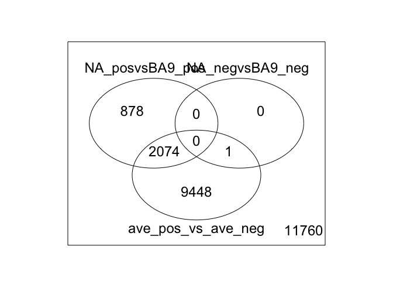

This is consistent with what we expect: lots of DE genes between NeuN+ and NeuN- cells, lots of DE genes in NeuN+ cells between NA and BA9, and almost no DE genes in NeuN- cells between NA and BA9.

### Mean-difference plots

Let's take a look at the mean-difference plot (aka MA plot) for each comparison. In each plot the genes highlighted have an adjusted P-value &lt; 0.05

``` r
plotMD(fit_with_sv, column = 1, 
       status = ifelse(
         topTable(fit_with_sv, coef = 1, n = Inf, 
                  sort.by = "none")$adj.P.Val < 0.05, 
         "DE", "Not DE"), 
       hl.col = "orange", legend = "bottomright")
```

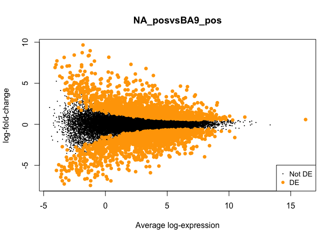

``` r
plotMD(fit_with_sv, column = 2, 
       status = ifelse(
         topTable(fit_with_sv, coef = 2, n = Inf,
                  sort.by = "none")$adj.P.Val < 0.05, 
         "DE", "Not DE"), 
       hl.col = "orange", legend = "bottomright")
```

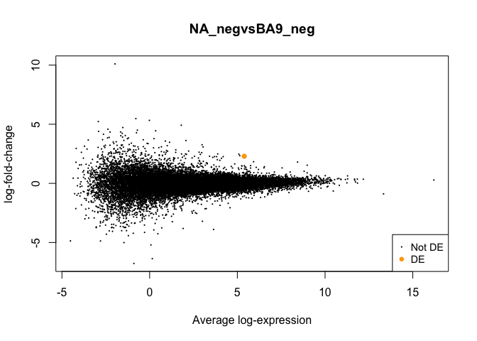

``` r
plotMD(fit_with_sv, column = 3, 
       status = ifelse(
         topTable(fit_with_sv, coef = 3, n = Inf,
                  sort.by = "none")$adj.P.Val < 0.05, 
         "DE", "Not DE"), 
       hl.col = "orange", legend = "bottomright")
```

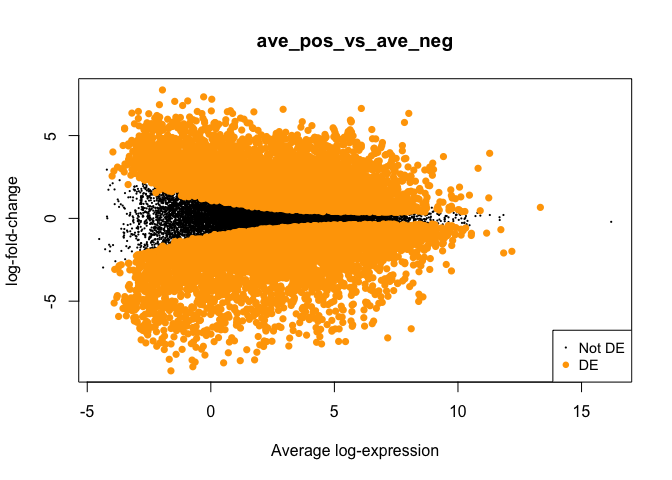

### Writing the DE gene list

Finally, write the output of `topTable()`, the table of top genes from the linear model fit, to disk as a CSV file for the overall F-statistic as well as for each of the comparisons of interest.

**NOTE:** The gene name is the first column although this column is unnamed in the CSV file

``` r
# Example of topTable output, looking at top hits ranked by B (log odds of DE)
topTable(fit_with_sv, coef = "NA_posvsBA9_pos")
#>                        logFC  AveExpr         t      P.Value    adj.P.Val
#> ENSG00000173175.10  3.407616 7.206842  16.90615 2.291417e-12 2.472187e-08
#> ENSG00000134138.15  3.241485 6.479754  16.89300 2.321417e-12 2.472187e-08
#> ENSG00000108370.11  5.939185 3.881628  16.61281 3.069641e-12 2.472187e-08
#> ENSG00000015133.14  4.647360 6.074530  15.79036 7.144758e-12 4.315612e-08
#> ENSG00000164649.15  4.568452 3.850559  15.20143 1.340099e-11 6.062459e-08
#> ENSG00000115155.12  4.720032 4.001355  14.96943 1.726895e-11 6.062459e-08
#> ENSG00000149295.9   5.336892 2.817598  14.95402 1.756435e-11 6.062459e-08
#> ENSG00000196557.6   3.686230 4.369712  14.45394 3.071253e-11 9.275568e-08
#> ENSG00000109906.9  -3.049789 6.434983 -14.09272 4.646311e-11 1.011683e-07
#> ENSG00000076864.15  2.339717 9.012382  14.04419 4.915387e-11 1.011683e-07
#>                           B
#> ENSG00000173175.10 18.60377
#> ENSG00000134138.15 18.56122
#> ENSG00000108370.11 17.87618
#> ENSG00000015133.14 17.46066
#> ENSG00000164649.15 16.52505
#> ENSG00000115155.12 16.51336
#> ENSG00000149295.9  16.30052
#> ENSG00000196557.6  16.01099
#> ENSG00000109906.9  15.64673
#> ENSG00000076864.15 15.58158

# Write each to disk
coefs <- c(list(NULL), as.list(colnames(fit_with_sv)))
lapply(coefs, function(coef, fit, model) {
  fn <- gzfile(paste0("../extdata/topTable.", ifelse(is.null(coef), "F-stat", 
                                                     coef),
                      ".RNA-seq.csv.gz"))
  write.csv(x = topTable(fit, coef = coef, n = Inf),
            file = fn, 
            row.names = TRUE,
            quote = FALSE)
  fn2 <- gzfile(paste0("../extdata/DEGs.", ifelse(is.null(coef), "F-stat", 
                                                 coef), 
                       ".RNA-seq.csv.gz"), 
                open = "w")
  write.csv(x = topTable(fit, coef = coef, n = Inf, p.value = 0.05),
            file = fn2, 
            row.names = TRUE,
            quote = FALSE)
  close(fn2)
}, fit = fit_with_sv)
#> [[1]]
#> NULL
#> 
#> [[2]]
#> NULL
#> 
#> [[3]]
#> NULL
#> 
#> [[4]]
#> NULL
saveRDS(fit_with_sv, "../objects/fit_with_sv.rds")
saveRDS(elist_with_sv, "../objects/elist_with_sv.rds")
```

Incorporating `DONOR` as a random effect
----------------------------------------

There is some question as to whether we can/should incorporate `DONOR` as a random effect, in addition to or instead of blocking on it in the linear modelling.

Gordon offers some advice on this topic at <https://mailman.stat.ethz.ch/pipermail/bioconductor/2014-February/057887.html>

> The first method is twoway anova, a generalization of a paired analysis. The second method is a random effects approach in which the intra-donor correlation is incorporated into the covariance matrix instead of the linear predictor. Both are good methods. The twoway anova approach makes fewer assumptions but the random effects approach is statistically more powerful, particularly for unbalanced designs. For a balanced design in which all donors receive all stimuli, the twoway anovao approach is virtually as powerful as the random effects approach and hence is preferable. For an unbalanced design in which each donor receives only a subset of the stimula, the random effects approach is more powerful. Your experiment is almost completely balanced -- there is just one missing stimuli for one donor. Hence I would use the twoway anova approach.

We have a slightly unbalanced design. Notably, Gordon recommends including `DONOR` in a twoway ANOVA **or** treating `DONOR` as a random effect, not doing both. In fact, we see that when we try to do both that we have problems estimating the correlation with `limma::duplicateCorrelation()`.

We decided to include `DONOR` in the design matrix and not as a random effect.
