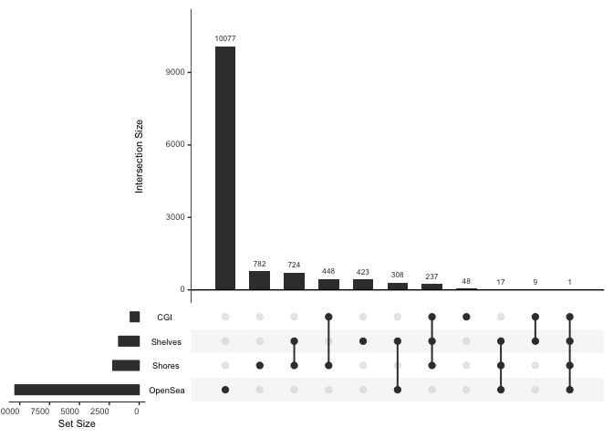
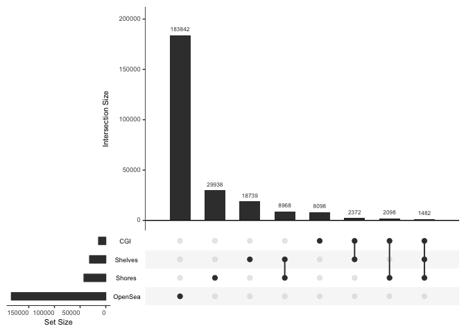
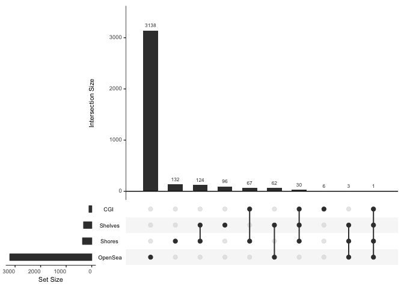
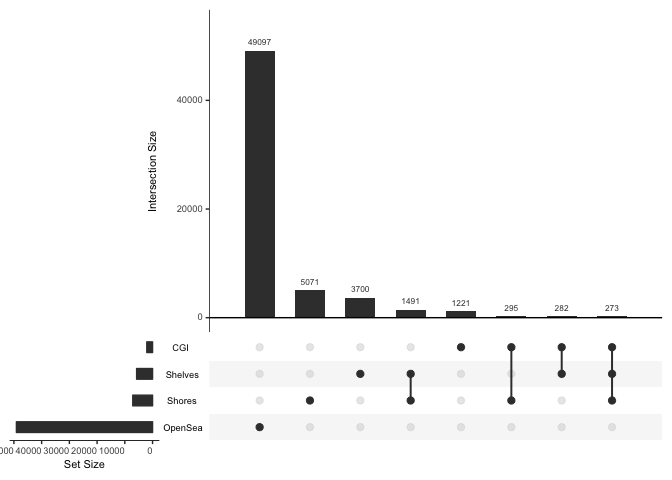
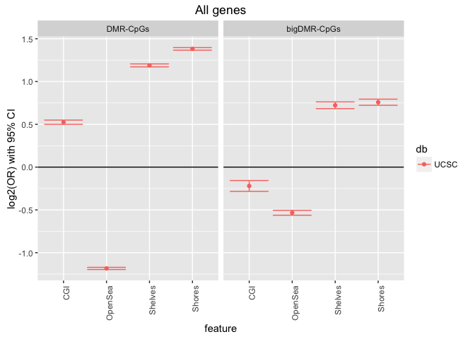

Context and enrichment/depetion of DMRs with respect to CGI features
================
Peter Hickey
13 November 2016

-   [CGI context of DMRs and bigDMRs](#cgi-context-of-dmrs-and-bigdmrs)
    -   [DMRs](#dmrs)
    -   [DMR-CpGs](#dmr-cpgs)
    -   [bigDMRs](#bigdmrs)
    -   [bigDMR-CpGs](#bigdmr-cpgs)
-   [CGI enrichment/depletion of DMR-CpGs and bigDMR-CpGs](#cgi-enrichmentdepletion-of-dmr-cpgs-and-bigdmr-cpgs)
    -   [DMR-CpGs](#dmr-cpgs-1)
    -   [bigDMR-CpGs](#bigdmr-cpgs-1)

CGI context of DMRs and bigDMRs
===============================

Using all POS DMRs

DMRs
----

-   Vast majority of DMRs in open sea

DMR-CpGs
--------

Counting CpGs in DMRs rather than number of DMRs

-   And, unsurprisingly, most DMR-CpGs are in open sea

bigDMRs
-------

-   Vast majority of bigDMRs are in open sea

bigDMR-CpGs
-----------

Counting CpGs in bigDMRs rather than number of bigDMRs

-   And, unsurprisingly, most bigDMR-CpGs are in open sea

CGI enrichment/depletion of DMR-CpGs and bigDMR-CpGs
====================================================

Using all POS DMRs

### DMR-CpGs

-   Enriched in shores, shelves, and CGIs, depleted in open sea

### bigDMR-CpGs

-   Enriched in shelves and shores, depleted in CGI and open sea
