Overlap of DMRs and DARs
================
Peter Hickey
4 July 2017

-   [Do DMRs and DARs overlap?](#do-dmrs-and-dars-overlap)
    -   [DMRs](#dmrs)
    -   [bigDMRs](#bigdmrs)
    -   [OCRs](#ocrs)
    -   [DARs](#dars)
    -   [bigDARs](#bigdars)
-   [How close are DMRs and DARs?](#how-close-are-dmrs-and-dars)
    -   [Exclude overlapping features](#exclude-overlapping-features)
    -   [Separating 'internal' from 'overlapping'](#separating-internal-from-overlapping)
-   [Distance to nearest DAR for DMRs that don't overlap a DAR](#distance-to-nearest-dar-for-dmrs-that-dont-overlap-a-dar)
    -   [First way](#first-way)
    -   [Second way](#second-way)
    -   [Summary](#summary)
-   [DMR enrichment/depletion of ATAC peaks, DARs, and bigDARs](#dmr-enrichmentdepletion-of-atac-peaks-dars-and-bigdars)
    -   [Counting peaks](#counting-peaks)
    -   [Counting bases](#counting-bases)
-   [Enrichment of DARs that overlap DMRs](#enrichment-of-dars-that-overlap-dmrs)
    -   [chromHMM](#chromhmm)
    -   [CpGs](#cpgs)
-   [Enrichment of DMR-CpGs within DARs](#enrichment-of-dmr-cpgs-within-dars)
    -   [GENCODE](#gencode)
    -   [Enhancers](#enhancers)

Do DMRs and DARs overlap?
=========================

-   Are DMRs and DARs identifying the same or different regions of the genome?
-   If different, how different?

DMRs
----

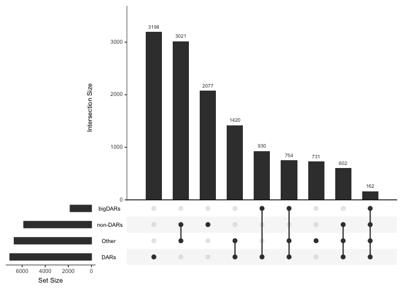

-   Most DMRs overlap an OCR (union)
    -   94% overlap
-   Only half of DMRs overlap a DAR
    -   55% overlap
-   Only a minor of DMRs overlap a bigDAR (|logFC| &gt; 1)
    -   14% overlap

bigDMRs
-------

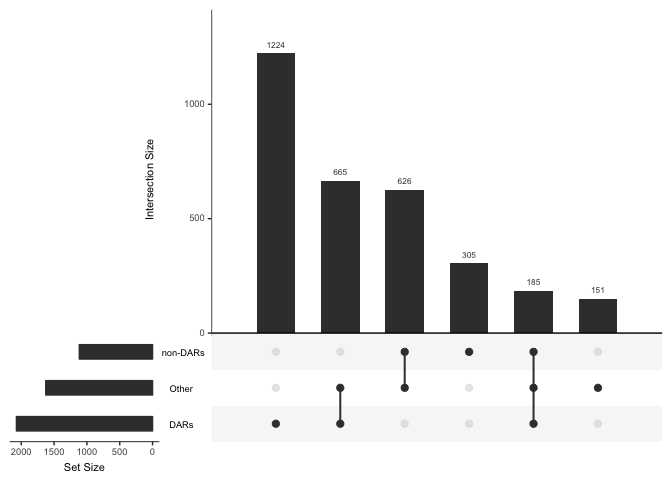

-   Most bigDMRs overlap an OCR (union) (95% overlap)
-   Most bigDMRs overlap a DAR (66% overlap)

OCRs
----

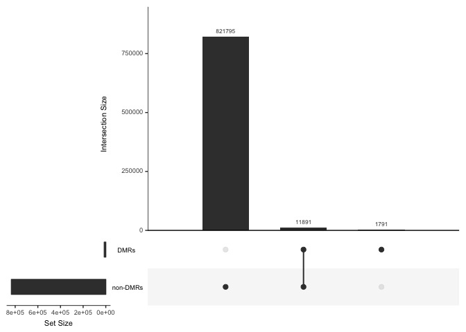

-   Most OCRs don't overlap a DMR (2% overlap)

DARs
----

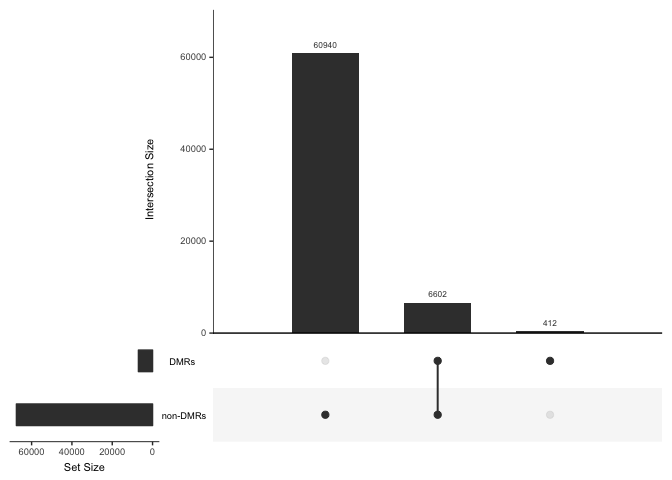

-   Most DARs don't overlap a DMR (10% overlap)

bigDARs
-------

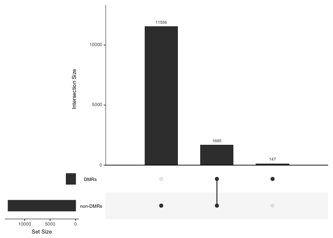

-   Most bigDARs don't overlap a DMR (14% overlap)

How close are DMRs and DARs?
============================

Observed DARs near boundaries of DMRs in a few examples; how common is this?

-   Compute `distanceToNearest()` for DMRs and DARs

**NOTE:** Add 1 to distance to avoid taking log(0) (occurs when `x` is inside `subject`)

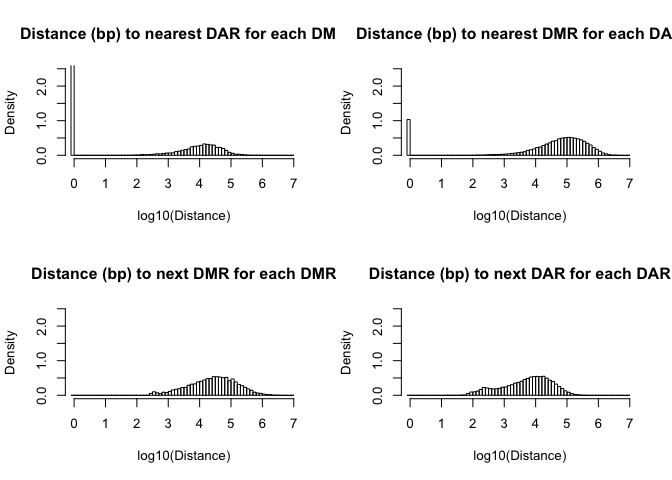

-   Spike at 0 in upper panel corresponds to DMRs and DARs overlapping

Exclude overlapping features
----------------------------

Repeat the above, but excluding DARs (resp. DMRs) that are entirely within a DMR (resp. DAR).

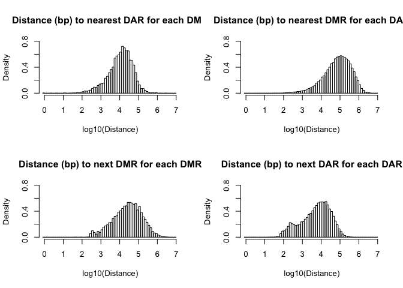

-   Once overlapping features are excluded, the distributions aren't so different when going from a DMR to the nearest DMR or DAR (compare top panel to bottom panel)
-   Slight exception for DARs, which are more often within a short distance of another DAR

Separating 'internal' from 'overlapping'
----------------------------------------

Is there a preference for DMRs that overlap a DAR to have an 'internal' or 'overlapping' DAR.

-   Take summit of DARs that overlap DMRs and see if there is a bias for the peak to be centered within the DMR or outside the DMR

-   Of the minority that do overlap a DAR, the majority contain the summit of the DAR (4334 / 7066)

Distance to nearest DAR for DMRs that don't overlap a DAR
=========================================================

First way
---------

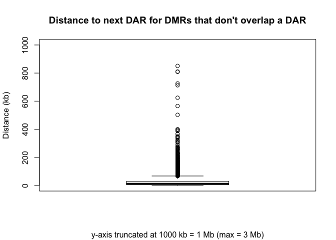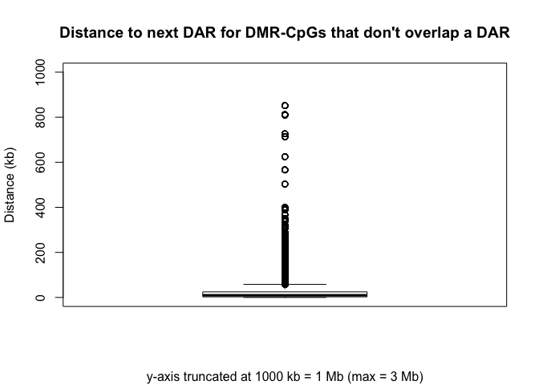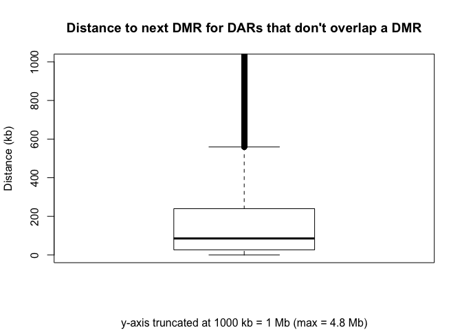

Second way
----------

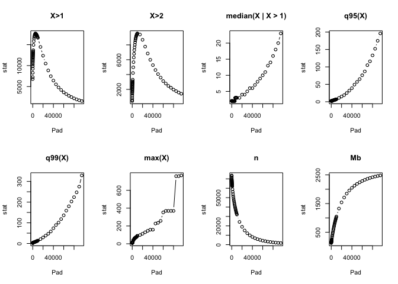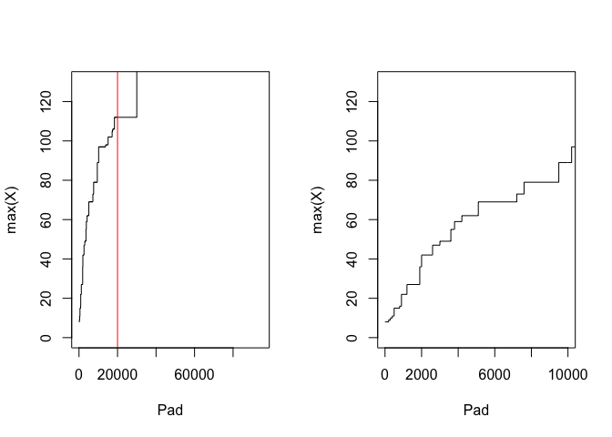

-   The maximum number DMRs/DARs is a 'spiky' statistic since it's an extreme value of the distribution. All other stats shown are smooth
-   Can we use this to find 'hotspots' of the genome?
    -   Spikes at +/- 500 bp and +/- 6100 bp

The region with the maximum number of hits, chr7:157459649-157487891, contains the gene *SIX3*, which "is crucial in embryonic development for the foremation of the forebrain and eye development ... Activity of SIX3 gene represses Wnt1 gene actiity" (<https://en.wikipedia.org/wiki/SIX3>). In fact, the region contains multiple DEGs, in addition to the multiple DARs and DMRs (which exist via construction).

Take all regions +/- 5kb with &gt; 4 hits, `dmr_dar_clusters`

Of course, a large number of DMRs/DARs in a region might really be an indication that the boundaries of these DMRs/DARs were poorly defined to begin with.

Summary
-------

-   DMRs tend to overlap DARs, but DARs don't tend to overlap DMRs
-   DMRs and DARs do not tend to overlap
-   The majority (45%) of DMRs do overlap a DAR
-   A minority ((14%) of DMRs overlap a big DAR (|logFC| &gt; 1)
-   The median distance to the nearest DAR for DMRs that don't overlap a DAR is 13 kb
-   The median distance to the nearest DAR for DMR-CpGs that don't overlap a DAR is 10 kb
-   The median distance to the nearest DMR for DARs that don't overlap a DMR is 85 kb

DMR enrichment/depletion of ATAC peaks, DARs, and bigDARs
=========================================================

We consider enrichment of:

1.  Peaks vs. rest of genome
2.  DARS vs. rest of genome
    1.  bigDARs vs. rest of genome
3.  DARs vs. null-peaks
    1.  bigDARs vs. null-peaks

We consider two different ways to calculate enrichment using ATAC-seq data:

A. Counting peaks (only 3, 4) B. Counting bases (1, 2, 3, 4)

Counting peaks
--------------

### DARs vs. null-peaks

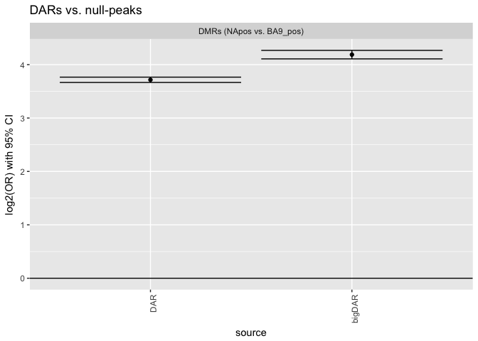

Counting bases
--------------

### Peaks vs. rest of genome

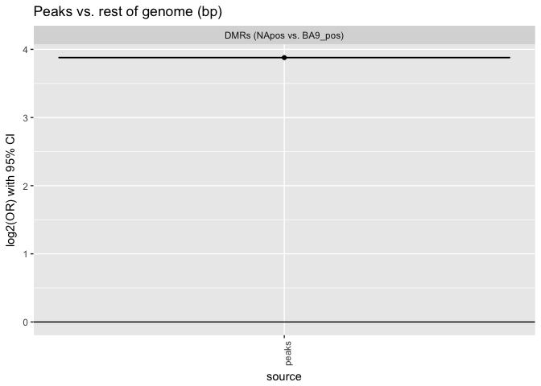

### DARs vs. rest of genome

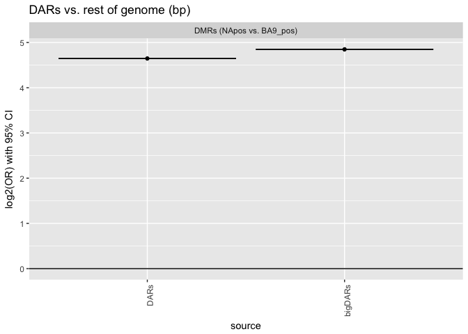

### DARs vs. null peaks

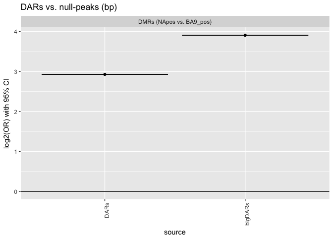

Enrichment of DARs that overlap DMRs
====================================

chromHMM
--------

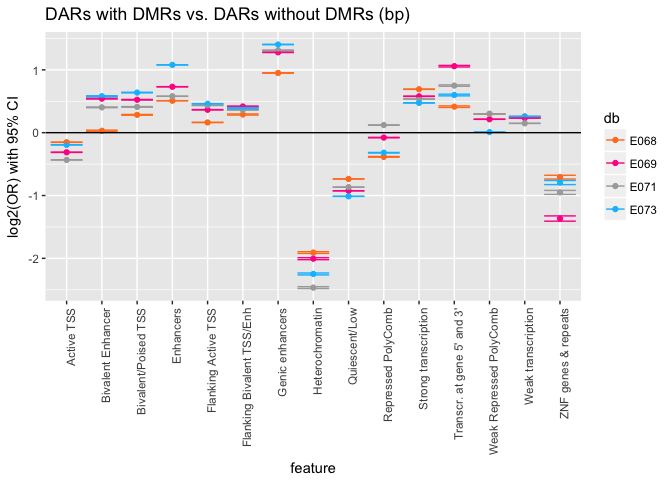

CpGs
----

Unsurprisingly, DARs that overlap a DMR are slightly enriched for covered CpGs compared to DARs that do not overlap a DMR (log2(OR) = 0.3)

Enrichment of DMR-CpGs within DARs
==================================

Compare `intersect(dmrs_NAvsBA9pos_cpgs, dars_pos)` to `setdiff(dmrs_NAvsBA9pos_cpgs, dars_pos)`

GENCODE
-------

Mostly interested in whether enrichment in promoters

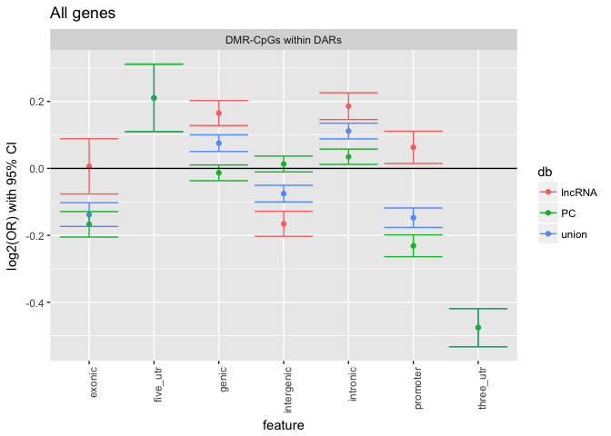

Enhancers
---------

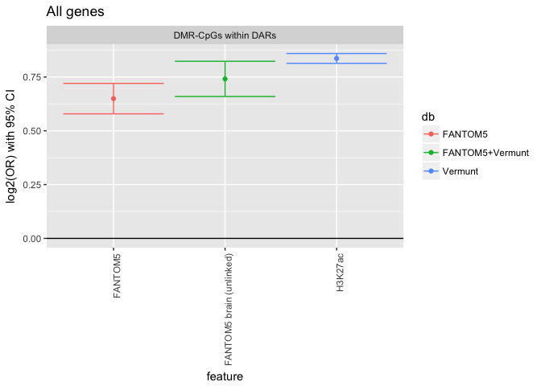
