Context and enrichment/depetion of DMRs and DARs with respect to GENCODE features
================
Peter Hickey
4 July 2016

-   [Genomic context of DMRs and bigDMRs](#genomic-context-of-dmrs-and-bigdmrs)
    -   [DMRs](#dmrs)
    -   [DMR-CpGs](#dmr-cpgs)
    -   [bigDMRs](#bigdmrs)
    -   [bigDMR-CpGs](#bigdmr-cpgs)
-   [Genomic context of OCRs, DARs, and bigDARs](#genomic-context-of-ocrs-dars-and-bigdars)
    -   [OCRs](#ocrs)
    -   [DARs](#dars)
    -   [bigDARs](#bigdars)
-   [Genomic enrichment/depletion of DMR-CpGs and bigDMR-CpGs](#genomic-enrichmentdepletion-of-dmr-cpgs-and-bigdmr-cpgs)
    -   [Using DMRs vs. DMR-CpGs is misleading for enrichment analyses](#using-dmrs-vs.-dmr-cpgs-is-misleading-for-enrichment-analyses)
    -   [Using all genes](#using-all-genes)
    -   [Focusing on DEGs (NA\_pos vs. BA9\_pos)](#focusing-on-degs-na_pos-vs.-ba9_pos)
    -   [Focusing on non-DEGs](#focusing-on-non-degs)
-   [Genomic enrichment/depletion of OCRs, DARs, and bigDARs](#genomic-enrichmentdepletion-of-ocrs-dars-and-bigdars)
    -   [Counting peaks](#counting-peaks)

Genomic context of DMRs and bigDMRs
===================================

Using all POS DMRs

DMRs
----

|                     |  percentage|
|---------------------|-----------:|
| exon\_promoter\_utr |  25.7457549|
| wholly\_intronic    |  37.5936974|
| wholly\_intergenic  |  36.6528989|
| other               |   0.0076488|

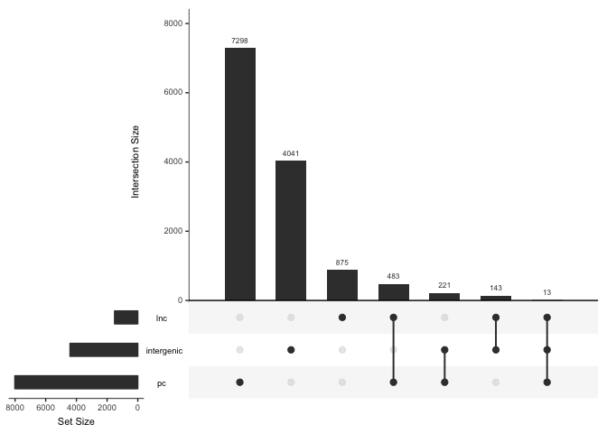

DMR-CpGs
--------

Counting CpGs in DMRs rather than number of DMRs

|                     |  percentage|
|---------------------|-----------:|
| exon\_promoter\_utr |  20.6412379|
| wholly\_intronic    |  45.3057679|
| wholly\_intergenic  |  34.0416456|
| other               |   0.0113487|

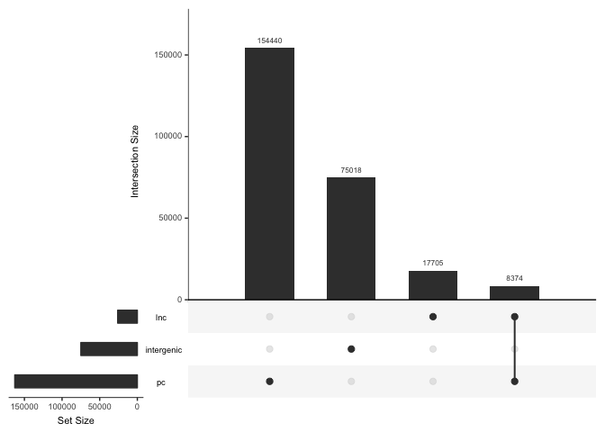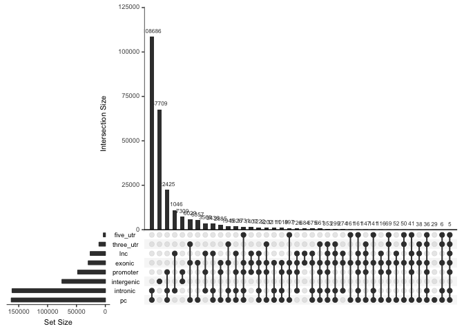

bigDMRs
-------

|                     |  percentage|
|---------------------|-----------:|
| exon\_promoter\_utr |    20.38808|
| wholly\_intronic    |    37.60590|
| wholly\_intergenic  |    42.00601|
| other               |     0.00000|

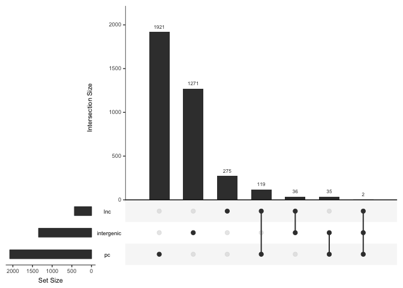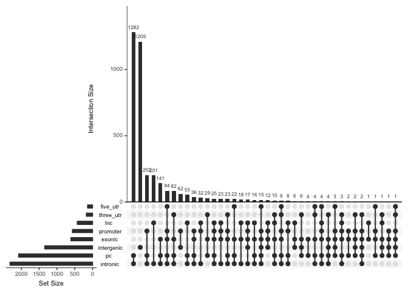

bigDMR-CpGs
-----------

Counting CpGs in bigDMRs rather than number of bigDMRs

|                     |  percentage|
|---------------------|-----------:|
| exon\_promoter\_utr |    16.96402|
| wholly\_intronic    |    45.36546|
| wholly\_intergenic  |    37.67052|
| other               |     0.00000|

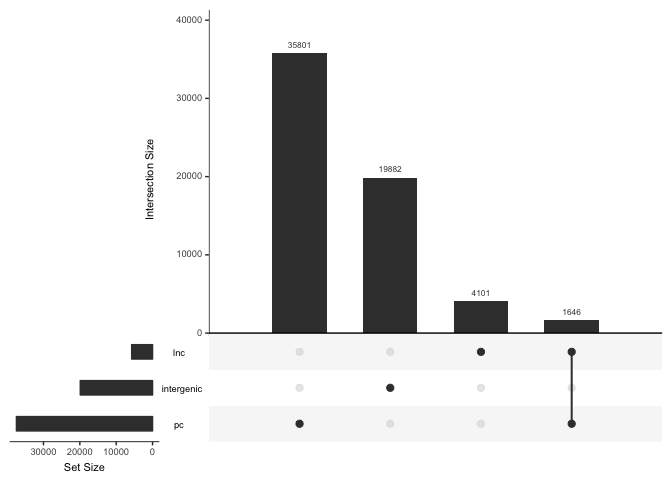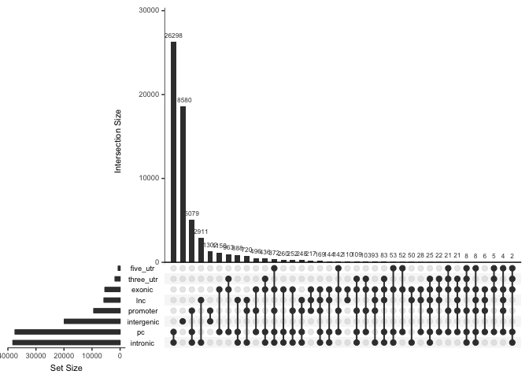

Genomic context of OCRs, DARs, and bigDARs
==========================================

Using 'overall' peaks and 'NApos vs. BA9pos' DARs.

OCRs
----

|                     |  percentage|
|---------------------|-----------:|
| exon\_promoter\_utr |  13.5001620|
| wholly\_intronic    |  38.3253230|
| wholly\_intergenic  |  48.1692558|
| other               |   0.0052592|

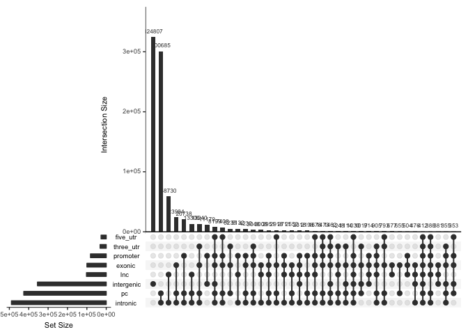

DARs
----

|                     |  percentage|
|---------------------|-----------:|
| exon\_promoter\_utr |  22.3489805|
| wholly\_intronic    |  34.4790579|
| wholly\_intergenic  |  43.1631408|
| other               |   0.0088208|

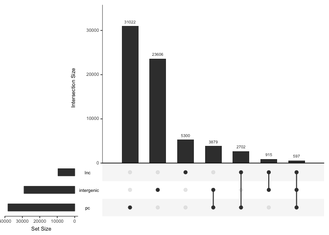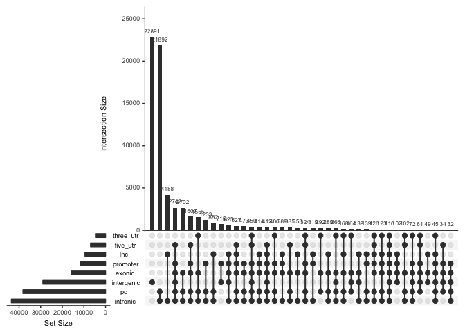

bigDARs
-------

|                     |  percentage|
|---------------------|-----------:|
| exon\_promoter\_utr |    9.618685|
| wholly\_intronic    |   34.213865|
| wholly\_intergenic  |   56.167450|
| other               |    0.000000|

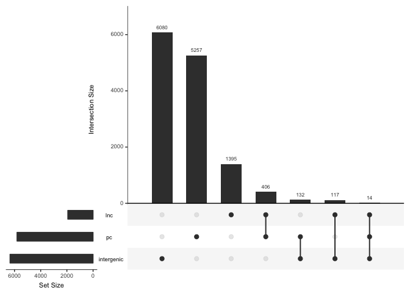

Genomic enrichment/depletion of DMR-CpGs and bigDMR-CpGs
========================================================

We initially consider all genes in GENCODE and then stratify by whether the gene is a DEG or a non-DEG.

Using DMRs vs. DMR-CpGs is misleading for enrichment analyses
-------------------------------------------------------------

It's very misleading to use "DMRs" vs. "non-DMRs" for enrichment/depletion analysis unless the regions are defined *a priori* and "non-DMRs" aren't simply `gaps(DMRs)`. It is better to use the number of CpGs in DMRs vs. the number of CpGs outside of DMRs. This can be seen in the below figure; we only use "DMR-CpGs" vs. "non-DMR-CpGs" in the remaining analyses.

Using all genes
---------------

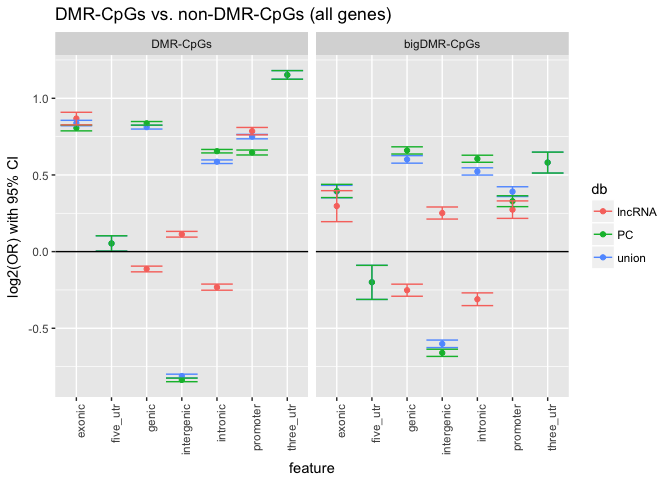

### DMR-CpGs

**Union**

-   Enriched in exonic, genic, intronic, promoter, and 3' UTR regions
-   Little-to-no enrichment in 5' UTR regions
-   Depleted in intergenic regions

**PC transcripts**

-   Overall, nearly identical to union

**lncRNA transcripts**

-   Overall, broadly similar to union
-   Weaker enrichment/depletion (near zero) in genic, intergenic, and intronic regions

### bigDMR-CpGs

**Union, PC transcripts, lncRNA transcripts**

-   Same overall trend as DMR-CpGs with slightly wider CIs
-   Slightly weaker enrichment/depletion in exonic, promoter, and 3' UTR regions

### PC-intergenic DMRs

Of the DMRs that are wholly intergenic (wrt PC genes), where do they hit wrt lncRNA genes?

-   9.9958264% of wholly PC-intergenic DMRs overlap lncRNA exons and promoters
-   11.9365609% of wholly PC-intergenic DMRs are wholly within introns

Focusing on DEGs (NA\_pos vs. BA9\_pos)
---------------------------------------

Same plots as above, but using comparisons of NA\_pos vs. BA9\_pos and restricted to DEGs

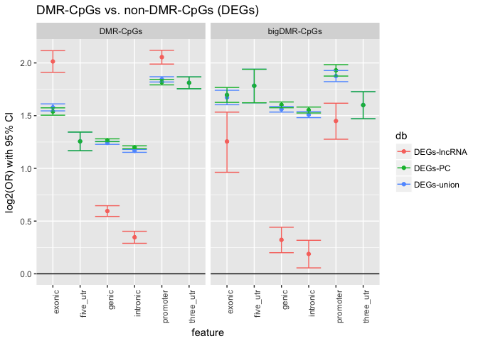

### DMR-CpGs

**Union**

-   Enriched in all categories (recall this plot excludes intergenic)
-   Strongest enrichment in promoter and 3' UTR regions

**PC transcripts**

-   Overall, nearly identical to union

**lncRNA transcripts**

-   Overall, broadly similar to union
-   Stronger enrichment in exonic and promoter regions
-   Weaker enrichment in genic and intronic regions

### bigDMR-CpGs

**Union and PC transcripts**

-   Same overall trend as DMR-CpGs with slightly wider CIs
-   Slightly weaker enrichment/depletion in exonic, promoter, and 3' UTR regions

**lncRNA transcripts**

-   Same overall trend as DMR-CpGs with wider CIs
-   Weaker enrichment in exonic and promoter regions

Focusing on non-DEGs
--------------------

Same plots as above, but using comparisons of NA\_pos vs. BA9\_pos and restricted to non-DEGs

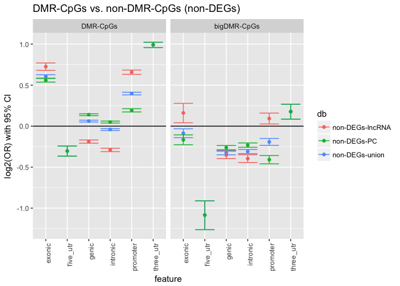

### DMR-CpGs

**Union**

-   Enriched all categories except 5' UTR regions (recall this plot excludes intergenic)
-   Enrichment is less strong than in DEGs

**PC transcripts**

-   Overall, fairly similar to union

**lncRNA transcripts**

-   Overall, broadly similar to union
-   Weaker enrichment in exonic and promoter regions
-   Depleted in genic, intronic, and (non-lncRNA) promoter regions

### bigDMR-CpGs

**Union, PC transcripts, and lncRNA transcripts**

-   Same overall trend as DMR-CpGs with wider CIs
-   Slightly weaker enrichment/depletion in exonic, promoter, and 3' UTR regions

Genomic enrichment/depletion of OCRs, DARs, and bigDARs
=======================================================

We initially consider all genes in GENCODE and then stratify by whether the gene is a DEG or a non-DEG.

We consider enrichment of:

1.  Peaks vs. rest of genome
2.  DARS vs. rest of genome
    1.  bigDARs vs. rest of genome
3.  DARs vs. null-peaks
    1.  bigDARs vs. null-peaks

We consider two different ways to calculate enrichment using ATAC-seq data:

A. Counting peaks (only 3, 4) B. Counting bases (1, 2, 3, 4)

Counting peaks
--------------

### DARs vs. null-peaks

#### Using all genes

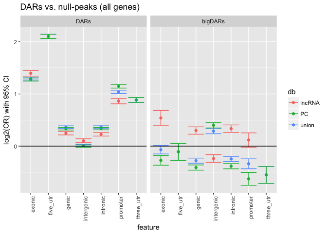

#### Focusing on DEGs

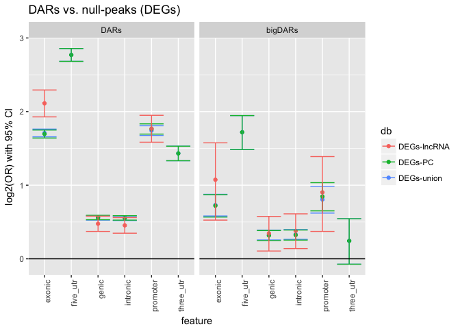

#### Focusing on non-DEGs

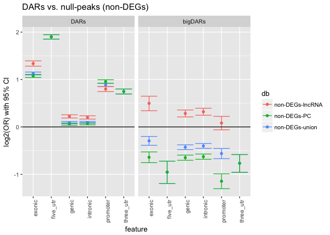 \#\# Counting bases

### Peaks vs. rest of genome

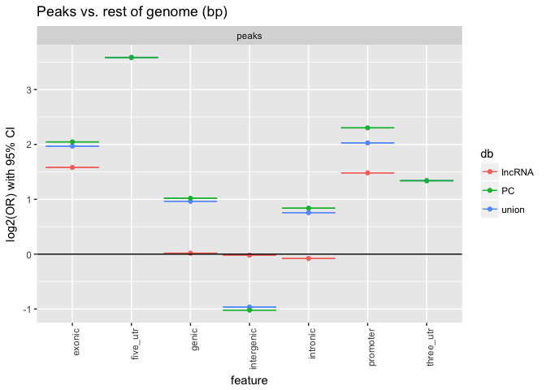

### DARS vs. rest of genome

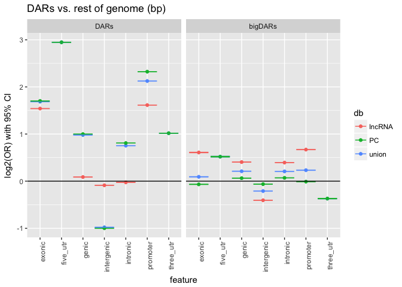

### DARs vs. null-peaks

#### Using all peaks

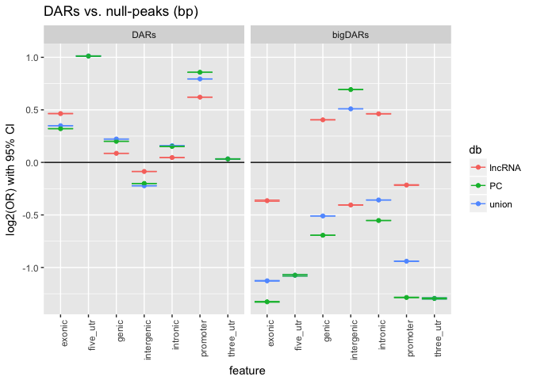

#### Focusing on DEGs

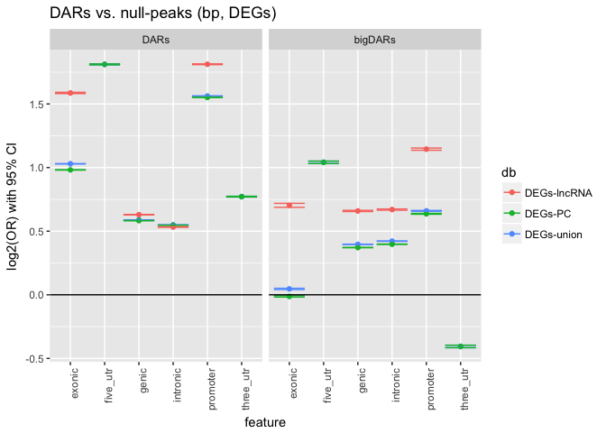

#### Focusing on non-DEGs

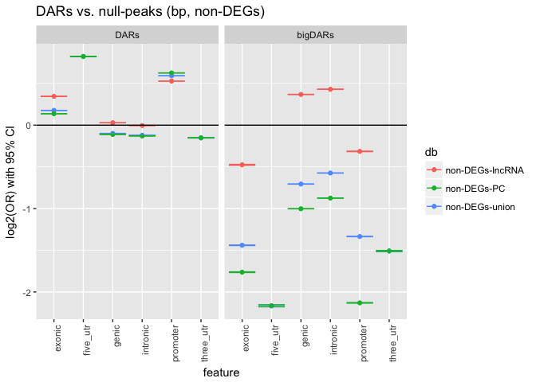
