Correlations of DARs and DMRs with DEGs
================
Peter Hickey
04 July 2017

-   [Overview](#overview)
-   [Promoters per gene](#promoters-per-gene)
-   [Enhancers per gene](#enhancers-per-gene)
-   [pDMRs](#pdmrs)
    -   [Co-occurence](#co-occurence)
    -   [Correlation](#correlation)
-   [pDARs](#pdars)
    -   [Co-occurence](#co-occurence-1)
    -   [Correlation](#correlation-1)
-   [Interaction of pDMRs and pDARs](#interaction-of-pdmrs-and-pdars)
    -   [pDMRs stratified by \[small|big\]pDAR presence/absence](#pdmrs-stratified-by-smallbigpdar-presenceabsence)
    -   [pDMRs stratified by number of pDARs](#pdmrs-stratified-by-number-of-pdars)
    -   [pDARs stratified by \[big\]pDMR presence/absence](#pdars-stratified-by-bigpdmr-presenceabsence)
    -   [pDARs stratified by number of pDMRs](#pdars-stratified-by-number-of-pdmrs)
    -   [Summary](#summary-4)
-   [eDMRs](#edmrs)
    -   [Co-occurence](#co-occurence-2)
    -   [Correlation](#correlation-2)
-   [eDARs](#edars)
    -   [Co-occurence](#co-occurence-3)
    -   [Correlation](#correlation-3)
-   [pDAR, pDMR, eDAR, and eDMR and their effect on gene expression](#pdar-pdmr-edar-and-edmr-and-their-effect-on-gene-expression)
    -   [Co-occurence](#co-occurence-4)
    -   [Correlation of chromatin accessibility and methylation with gene expression](#correlation-of-chromatin-accessibility-and-methylation-with-gene-expression)
    -   [Ranking plots](#ranking-plots)
    -   [DARs near genes](#dars-near-genes)

Overview
========

-   Are DEGs associated with DMRs and/or DARs in:
    -   Promoters
    -   Enhancers
-   Type of association:
    -   Co-occurence (i.e. presence/absence)
    -   Correlations (i.e. logFC vs. meanDiff for WGBS and logFC vs. logFC for ATAC-seq)

We use `dmrs_NAvsBA9pos` because we are specifically interested in relating DMRs, DARs, and DEGs for this comparison.

Recall that `fantom5_enhancers_by_gene` only includes TSS-associated enhancers for TSSs of protein-coding genes in GENCODE v19.

Promoters per gene
==================

-   Genes have multiple transcripts and therefore multiple promoters
    -   PC genes: median = 3 (min = 1, max = 70)
    -   lncRNA genes: 1 (min = 1, max = 63)
-   From [GENCODE.md](GENCODE.md), 2503 of the 12895 `dmrs_NAvsBA9pos` overlap at least one promoter
-   *A priori*, some genes more likely to have a DMR because of containing a CGI (and also likely also a shore)
    -   14254 of the 19823 PC genes and 3679 of the 13528 have at least one CGI-promoter

Enhancers per gene
==================

-   Genes may have multiple enhancers (using `fantom5_enhancers_by_gene`)
-   **Unlike promoters, enhancers may be linked to multiple genes**
    -   median = 2 (min = 1, max = 37) genes per enhancer (`tssa_enhancer_pairs`)
-   From [GENCODE.md](GENCODE.md), 691 of the 12895 `dmrs_NAvsBA9pos` overlap at least one enhancer (`brain_permissive_enhancers`)

pDMRs
=====

-   Dogma is that a methylated promoter leads to repression of that transcript
-   Empirically, this is crude (scatterplot isn't great)
-   Instead, focus on expression of genes with pDMRs (promoter DMRs)

Co-occurence
------------

-   Cross-tabulate whether a gene has a pDMR and is differentially expressed

### PC genes

|         |  non-DEG|   DEG|
|---------|--------:|-----:|
| no-pDMR |    13073|  1890|
| pDMR    |     1063|   512|

-   OR = 3.3 (3, 3.7)

### lncRNA genes

|         |  non-DEG|  DEG|
|---------|--------:|----:|
| no-pDMR |     6628|  469|
| pDMR    |      445|   81|

-   OR = 2.6 (2, 3.3)

### Summary

-   DEGs and pDMRs co-occur

Correlation
-----------

-   Take all genes with a pDMR and plot RNA-seq logFC against pDMR meanDiff

**NOTE:** Unlink when tabulating co-occurence, there is not need to explicitly removed genes that weren't tested for DE; these are automatically removed by `plot()` and `cor(..., use = "complete.obs")`.

### PC genes

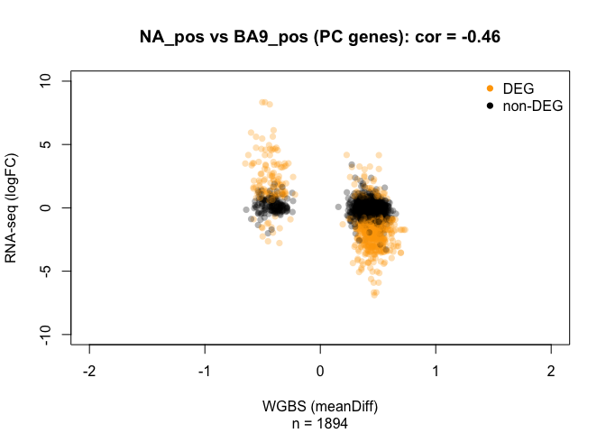

### lncRNA genes

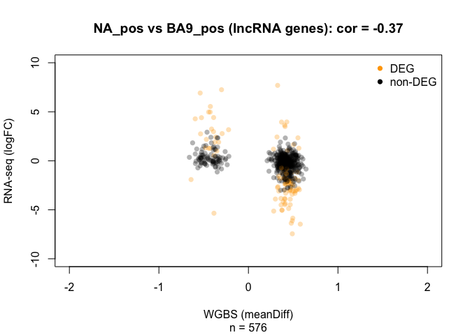

### Summary

-   The directionality of the relationship between RNA-seq logFC and WGBS meanDiff at genes with pDMRs is as expected

pDARs
=====

-   As for pDMRs, but looking at pDARs

Co-occurence
------------

-   Cross-tabulate whether a gene has a pDAR as is differentially expressed

### PC genes

|         |  non-DEG|   DEG|
|---------|--------:|-----:|
| no-pDAR |     8512|   945|
| pDAR    |     5624|  1457|

-   OR = 2.3 (2.1, 2.6)

### lncRNA genes

|         |  non-DEG|  DEG|
|---------|--------:|----:|
| no-pDAR |     5210|  299|
| pDAR    |     1863|  251|

-   OR = 2.3 (2, 2.8)

### Summary

-   DEGs and pDARs co-occur

Correlation
-----------

-   Take all genes with a pDAR and plot RNA-seq logFC against pDAR logFC

**NOTE:** Unlink when tabulating co-occurence, there is not need to explicitly removed genes that weren't tested for DE; these are automatically removed by `plot()` and `cor(..., use = "complete.obs")`.

### PC genes

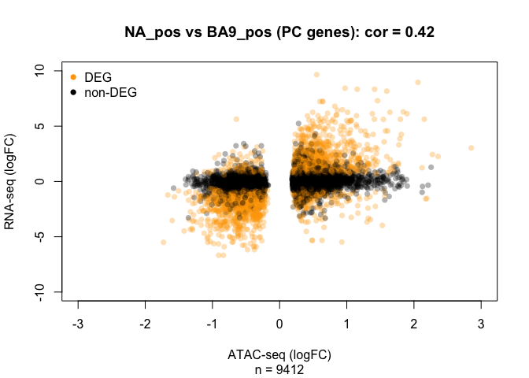

### lncRNA genes


### Summary

-   The directionality of the relationship between RNA-seq logFC and ATAC-seq logFC at genes with pDARs is as expected

Interaction of pDMRs and pDARs
==============================

-   How is the expression of a gene affected by having both a pDMR and a pDAR

**NOTE**: A gene may have multiple pDMRs or pDARs and so the same y-value may be plotted more than once

pDMRs stratified by \[small|big\]pDAR presence/absence
------------------------------------------------------

### PC genes

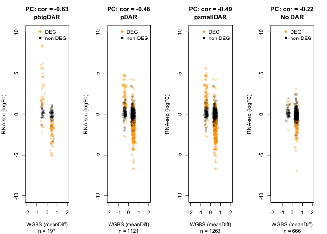

### lncRNA genes

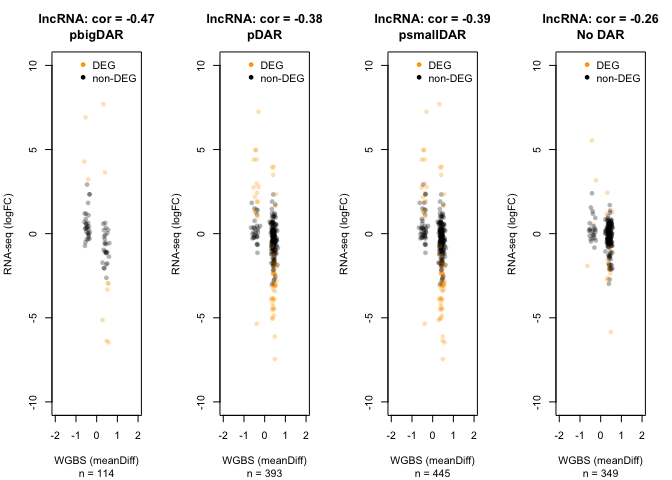

pDMRs stratified by number of pDARs
-----------------------------------

### PC genes

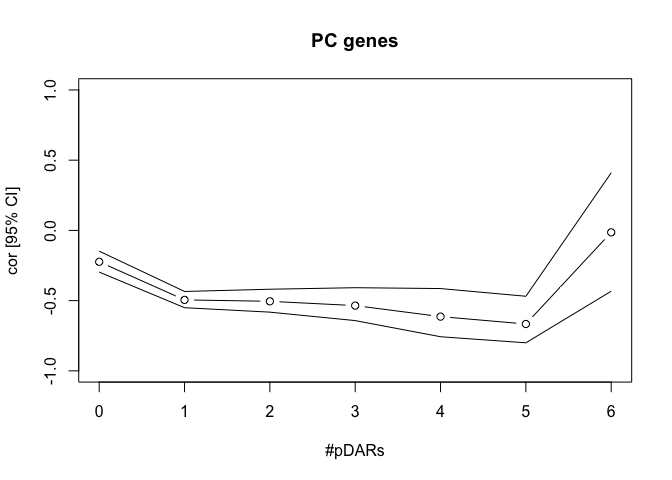

### lncRNA genes

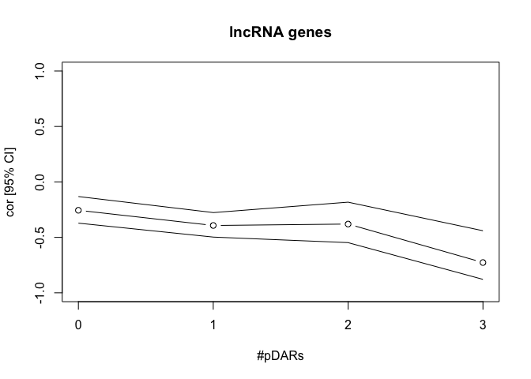

pDARs stratified by \[big\]pDMR presence/absence
------------------------------------------------

### PC genes

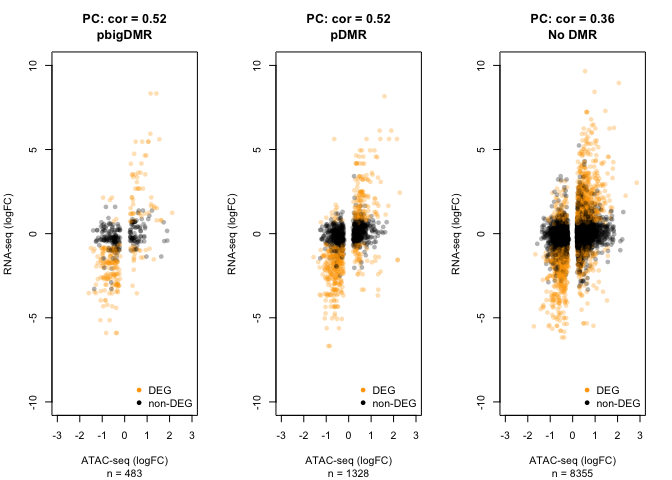

### lncRNA genes

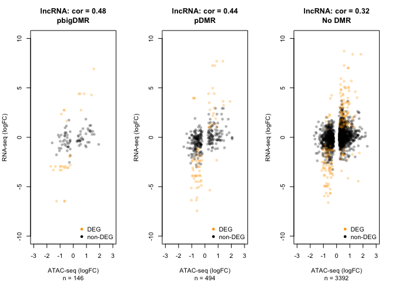

pDARs stratified by number of pDMRs
-----------------------------------

### PC genes

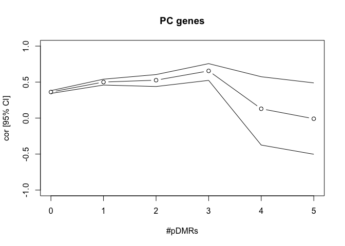

### lncRNA genes

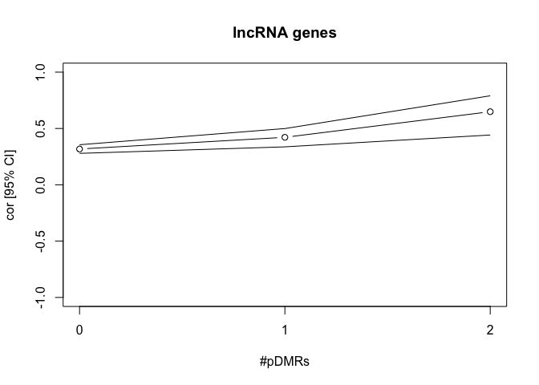

Summary
-------

-   Genes with a pDMR have the expected negative correlation between RNA-seq logFC and WGBS meanDiff
-   Genes with a pDAR have the expected positive correlation between RNA-seq logFC and ATAC-seq logFC
-   In both cases, by stratifying the genes by whether it additionally has a pDAR/pDMR increases the strength of the correlation
    -   Result(s) stronger for PC genes than lncRNA genes
    -   When stratifying by \[big|small\]pDARs, the correlation is strongest for DARs, followed by smallDARs, followed by no DARs
        -   There are too few bigDAR cases to draw any reliable conclusions
    -   When stratifying by \[big\]DMRs, the correlation is equally strong for bigDMRs and DMRs,
-   Also find that genes with more pDARs (resp. pDMRs) have a stronger negative (resp. positive) correlation between RNA-seq logFC and WGBS meanDiff (resp. ATAC-seq logFC)

eDMRs
=====

Co-occurence
------------

-   Cross-tabulate whether a gene has a eDMR and is differentially expressed

### Summary

|         |  non-DEG|   DEG|
|---------|--------:|-----:|
| no-eDMR |     7930|  1471|
| eDMR    |      892|   215|

-   OR = 1.3 (1.1, 1.5)
-   DEGs and eDMRs co-occur (but only slightly) in PC genes

Correlation
-----------

-   Take all genes with a eDMR and plot RNA-seq logFC against eDMR meanDiff

**NOTE:** Unlike when tabulating co-occurence, there is not need to explicitly removed genes that weren't tested for DE; these are automatically removed by `plot()` and `cor(..., use = "complete.obs")`.

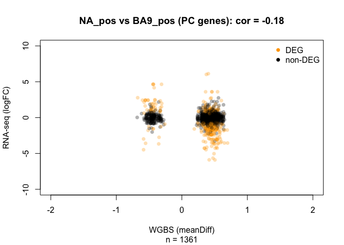

### Summary

-   The directionality of the relationship between RNA-seq logFC and WGBS meanDiff at genes with eDMRs is weakly negative. Unlike with promoters, less is known about the 'true' direction of this relationship

eDARs
=====

Co-occurence
------------

-   Cross-tabulate whether a gene has a eDAR and is differentially expressed

### Summary

|         |  non-DEG|  DEG|
|---------|--------:|----:|
| no-eDAR |     5019|  831|
| eDAR    |     3803|  855|

-   OR = 1.4 (1.2, 1.5)

-   DEGs and eDARs co-occur in PC genes

Correlation
-----------

-   Take all genes with a eDAR and plot RNA-seq logFC against eDAR meanDiff

**NOTE:** Unlink when tabulating co-occurence, there is not need to explicitly removed genes that weren't tested for DE; these are automatically removed by `plot()` and `cor(..., use = "complete.obs")`.

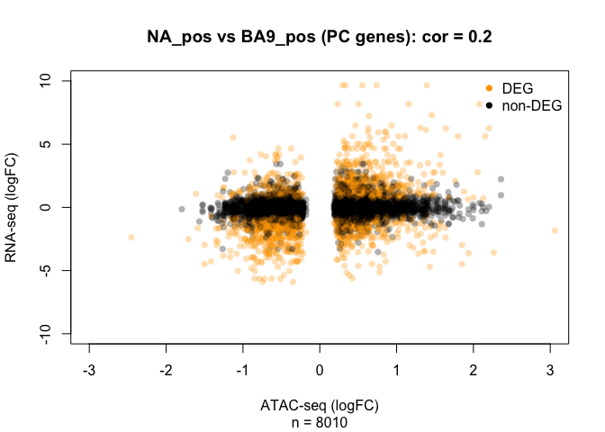

-   The directionality of the relationship between RNA-seq logFC and ATAC-seq logFC at genes with eDARs is weakly positive Unlike with promoters, less is known about the 'true' direction of this relationship

pDAR, pDMR, eDAR, and eDMR and their effect on gene expression
==============================================================

The data are stored in `rna_atac_meth`.

Co-occurence
------------

We tested 24161 gene for differential expression. The majority of these genes have no pDAR, pDMR, eDAR, or eDMR:

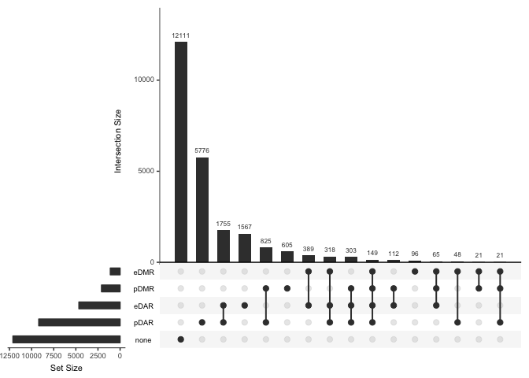

As expected, by focusing on the differentially expressed genes we find a larger proportion have at least one pDAR, pDMR, eDAR, or eDMR:

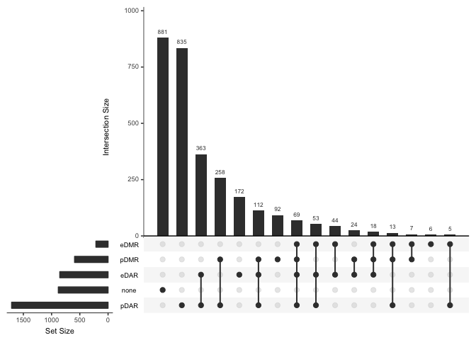

Correlation of chromatin accessibility and methylation with gene expression
---------------------------------------------------------------------------

Focusing on NA\_pos vs. BA9\_pos. For each gene, plot each sample's expression, chromatin accessibility at all promoter- and enhancer-linked peaks, average methlyation in DMRs that overlap all linked promtoers and enhancers. An example is shown for ENSG00000108370.11; this gene is differentially expressed, has DARs overlapping a promoter, and a DMR overlapping a promoter. Moreover, the directions of the relationship between expression and accessibility and the relationship between expression and methylation are as expected.

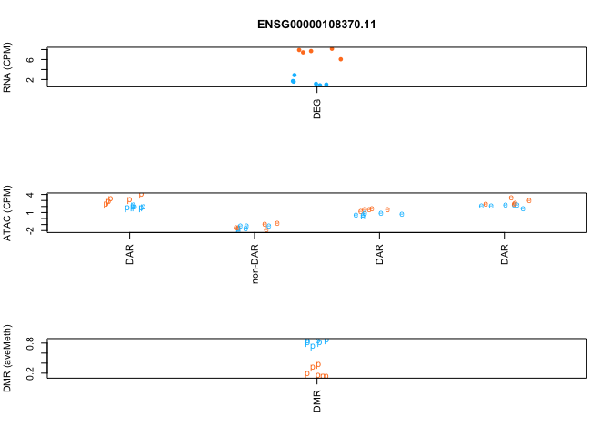

[`../figures/DE-genes-enhancer-promoter-triples.pdf`](../figures/DE-genes-enhancer-promoter-triples.pdf) shows these plots for 100 randomly selected DE genes and [`../figures/non-DE-genes-enhancer-promoter-triples.pdf`](../figures/non-DE-genes-enhancer-promoter-triples.pdf) shows these plots for 100 randomly selected non-DE genes [`../figures/DE-genes-enhancer-promoter-triples-with-all-hit.pdf`](../figures/DE-genes-enhancer-promoter-triples-with-all-hit.pdf) shows these plots for DE genes with at least on of each of pDMR, pDAR, eDMR, and eDAR.

Browsing these plots suggests the relationship between gene expression and pDMRs, pDARs, eDMRs, and eDARs is complicated; some in the expected direction(s) while others do not. To try to better understand these patterns, we tabulate their occurences and also summarise the relationships by correlation coefficients.

### Correlation densities

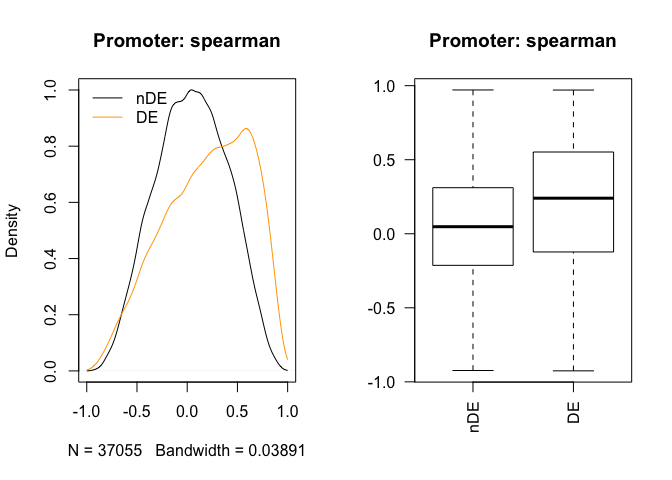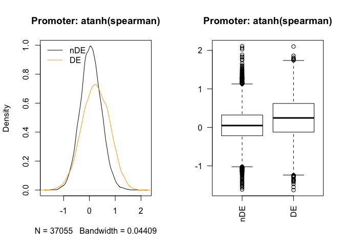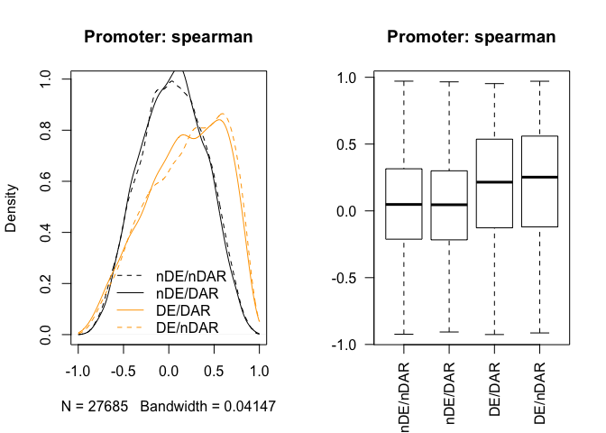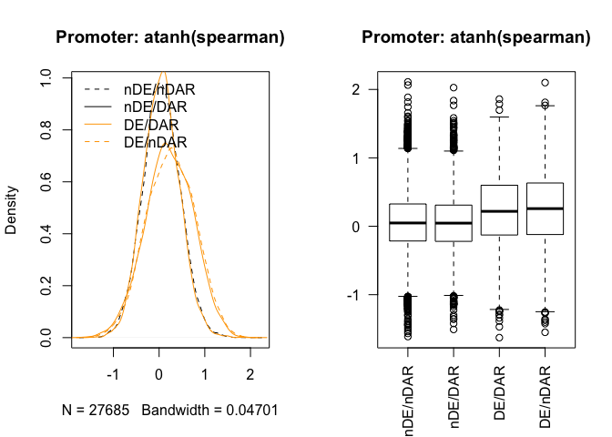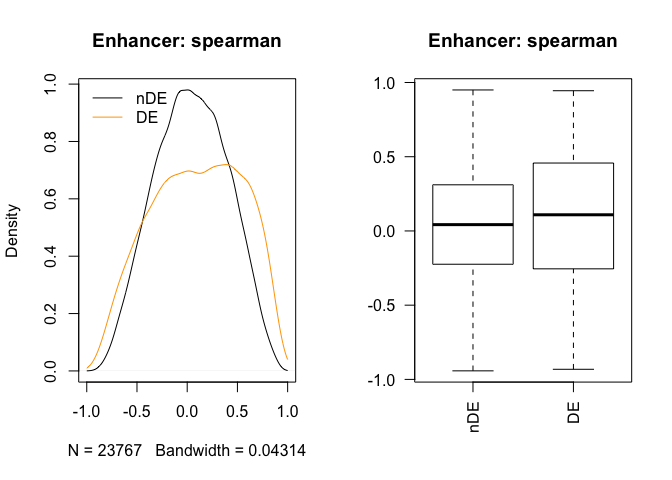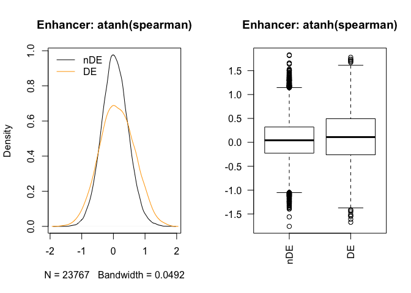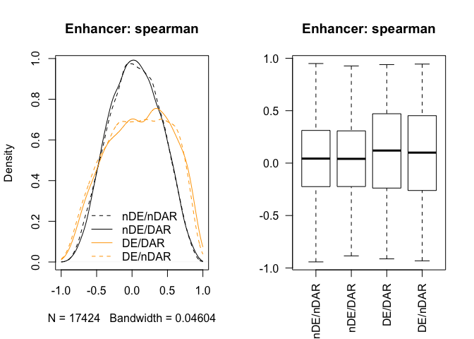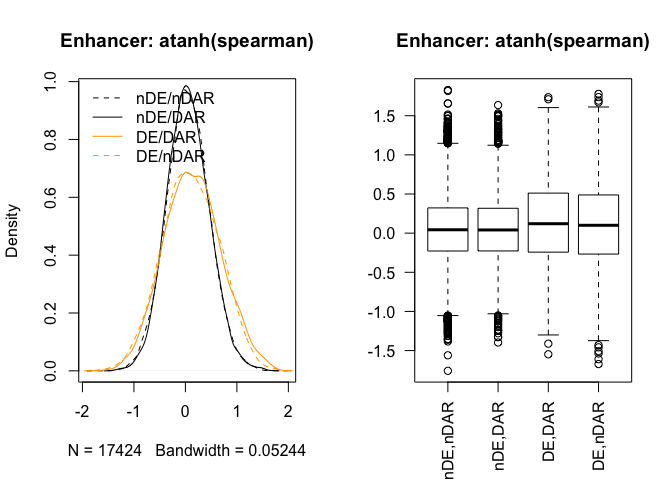

### Summary

On average, DEGs have a higher correlation between ATAC-seq and RNA-seq expression of the linked gene than non-DEGs. On average, this correlation is stronger for promoter-gene links than enhancer-gene links. There is no significant difference when further stratified by whether the ATAC-seq peak is a DAR or a non-DAR.

These plots are supported by tests of whether the average correlations are different in these conditions (using a t-test on the Fisher-transformed correlations).

``` r
# DEG vs non-DEG in promoter ATAC peaks
t.test(atanh(unlist(de_rho$rho_pAcc)), atanh(unlist(nonde_rho$rho_pAcc)))
#> 
#>  Welch Two Sample t-test
#> 
#> data:  atanh(unlist(de_rho$rho_pAcc)) and atanh(unlist(nonde_rho$rho_pAcc))
#> t = 28.488, df = 8577.5, p-value < 2.2e-16
#> alternative hypothesis: true difference in means is not equal to 0
#> 95 percent confidence interval:
#>  0.1763327 0.2023925
#> sample estimates:
#>  mean of x  mean of y 
#> 0.24238195 0.05301936
atan(t.test(atanh(unlist(de_rho$rho_pAcc)), atanh(unlist(nonde_rho$rho_pAcc)))$estimate)
#>  mean of x  mean of y 
#> 0.23779599 0.05296977
atan(t.test(atanh(unlist(de_rho$rho_pAcc)), atanh(unlist(nonde_rho$rho_pAcc)))$conf.int)
#> [1] 0.1745385 0.1996950
#> attr(,"conf.level")
#> [1] 0.95

# DEG vs non-DEG in enhancer ATAC peaks
t.test(atanh(unlist(de_rho$rho_eAcc)), atanh(unlist(nonde_rho$rho_eAcc)))
#> 
#>  Welch Two Sample t-test
#> 
#> data:  atanh(unlist(de_rho$rho_eAcc)) and atanh(unlist(nonde_rho$rho_eAcc))
#> t = 8.2025, df = 5807.2, p-value = 2.872e-16
#> alternative hypothesis: true difference in means is not equal to 0
#> 95 percent confidence interval:
#>  0.05258770 0.08561836
#> sample estimates:
#>  mean of x  mean of y 
#> 0.11904495 0.04994193
atan(t.test(atanh(unlist(de_rho$rho_eAcc)), atanh(unlist(nonde_rho$rho_eAcc)))$estimate)
#>  mean of x  mean of y 
#> 0.11848733 0.04990047
atan(t.test(atanh(unlist(de_rho$rho_eAcc)), atanh(unlist(nonde_rho$rho_eAcc)))$conf.int)
#> [1] 0.05253930 0.08541006
#> attr(,"conf.level")
#> [1] 0.95

# DEG vs non-DEG in pDARs vs non-pDARs
t.test(atanh(unlist(de_rho$rho_pAcc[unlist(de_rho$pDAR)])),
       atanh(unlist(de_rho$rho_pAcc[!unlist(de_rho$pDAR)])))
#> 
#>  Welch Two Sample t-test
#> 
#> data:  atanh(unlist(de_rho$rho_pAcc[unlist(de_rho$pDAR)])) and atanh(unlist(de_rho$rho_pAcc[!unlist(de_rho$pDAR)]))
#> t = -2.3053, df = 5232.6, p-value = 0.02119
#> alternative hypothesis: true difference in means is not equal to 0
#> 95 percent confidence interval:
#>  -0.055808604 -0.004512358
#> sample estimates:
#> mean of x mean of y 
#> 0.2230839 0.2532444
atan(t.test(atanh(unlist(de_rho$rho_pAcc[unlist(de_rho$pDAR)])),
       atanh(unlist(de_rho$rho_pAcc[!unlist(de_rho$pDAR)])))$estimate)
#> mean of x mean of y 
#> 0.2194900 0.2480299
atan(t.test(atanh(unlist(de_rho$rho_pAcc[unlist(de_rho$pDAR)])),
       atanh(unlist(de_rho$rho_pAcc[!unlist(de_rho$pDAR)])))$conf.int)
#> [1] -0.055750771 -0.004512327
#> attr(,"conf.level")
#> [1] 0.95
# DEG vs non-DEG in eDARs vs non-eDARs
t.test(atanh(unlist(de_rho$rho_eAcc[unlist(de_rho$eDAR)])),
       atanh(unlist(de_rho$rho_eAcc[!unlist(de_rho$eDAR)])))
#> 
#>  Welch Two Sample t-test
#> 
#> data:  atanh(unlist(de_rho$rho_eAcc[unlist(de_rho$eDAR)])) and atanh(unlist(de_rho$rho_eAcc[!unlist(de_rho$eDAR)]))
#> t = 2.1366, df = 3283.7, p-value = 0.0327
#> alternative hypothesis: true difference in means is not equal to 0
#> 95 percent confidence interval:
#>  0.002958625 0.068914221
#> sample estimates:
#> mean of x mean of y 
#> 0.1425616 0.1066251
atan(t.test(atanh(unlist(de_rho$rho_eAcc[unlist(de_rho$eDAR)])),
       atanh(unlist(de_rho$rho_eAcc[!unlist(de_rho$eDAR)])))$estimate)
#> mean of x mean of y 
#> 0.1416074 0.1062238
atan(t.test(atanh(unlist(de_rho$rho_eAcc[unlist(de_rho$eDAR)])),
       atanh(unlist(de_rho$rho_eAcc[!unlist(de_rho$eDAR)])))$conf.int)
#> [1] 0.002958616 0.068805435
#> attr(,"conf.level")
#> [1] 0.95
```

Ranking plots
-------------

We want to look at whether the signal in the promoter of a gene for both the ATAC-seq and the WGBS are in the 'expected/correct' direction with respect to the signal of the RNA-seq. E.g., we do not expect a differentially expressed gene with a positive logFC to a have a negative logFC in ATAC-seq data (or a positive meanDiff in the WGBS data) over a promoter of that gene.

### Proportion of matching signs

We first investigate this by plotting the proportion of 'expected/correct' signs amonst the top-N most differentially expressed genes (ranked by P-value).

(Top row all genes, bottom row zoomed in on top-3000 genes)

#### ATAC-seq

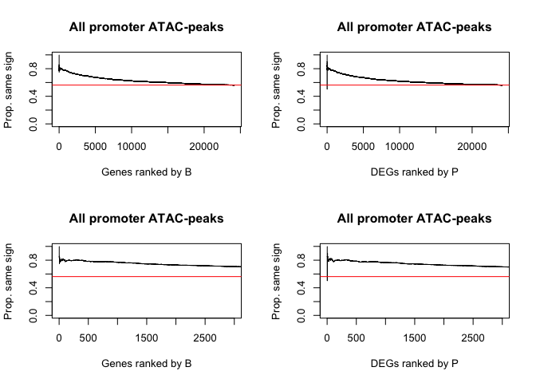

#### WGBS

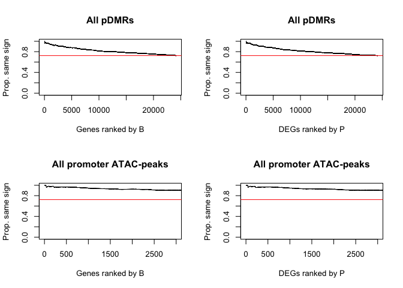

### Proportion of discordant signs

If a gene is not differentially expressed, then there should be a 50:50 chance that the observed logFC is positive or negative. A similar argument can be made for a ATAC-seq peak that is not differentially expressed. Therefore, the above plot where we requireme that the signs match may be too stringent. Instead, here we only count a pair as discordant if the ATAC-seq peak is a DAR and it has an 'unexpected' sign.

#### ATAC-seq


#### WGBS

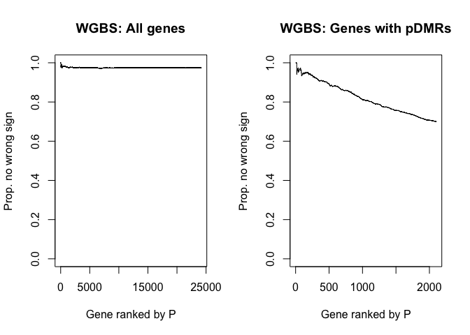

#### WGBS & ATAC-seq

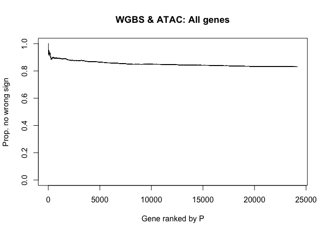

### Summary

At first glance, it appears that promoter differential methylation is more informative than promoter differential chromatin accessibility. However, for methylation we're only considering DMRs, whereas for ATAC-seq data we are considering all peaks regardless of whether they are DARs or not.

DARs near genes
---------------

Take all DARs near genes and plot RNA-seq logFC vs. ATAC-seq logFC; here we take 'near' to be 0 kb (overlapping gene body), 1 kb, 10 kb, and 100 kb.

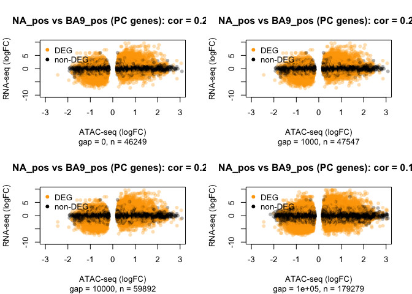
