Context and enrichment/depetion of DMRs and DARs with respect to enhancers
================
Peter Hickey
4 July 2017

-   [Summary](#summary)
-   [Enhancer context of DMRs and bigDMRs](#enhancer-context-of-dmrs-and-bigdmrs)
    -   [DMRs](#dmrs)
    -   [DMR-CpGs](#dmr-cpgs)
    -   [bigDMRs](#bigdmrs)
    -   [bigDMR-CpGs](#bigdmr-cpgs)
    -   [Summary](#summary-1)
-   [Enhancer enrichment/depletion of DMR-CpGs and bigDMR-CpGs](#enhancer-enrichmentdepletion-of-dmr-cpgs-and-bigdmr-cpgs)
    -   [Summary](#summary-2)
-   [Enhancer context of DARs and bigDARs](#enhancer-context-of-dars-and-bigdars)
    -   [DARs](#dars)
    -   [bigDARs](#bigdars)
    -   [Summary](#summary-3)
-   [Enhancer enrichment/depletion of ATAC-seq peaks, DARs, and bigDARs](#enhancer-enrichmentdepletion-of-atac-seq-peaks-dars-and-bigdars)
    -   [Counting peaks](#counting-peaks)
    -   [Counting bases](#counting-bases)

Summary
=======

We consider `permissive_enhancers`, `H3K27ac_brain`, and `brain_permissive_enhancers` (see [`objects.md`](objects.md)) and combine these into an list, `unlinked_enhancers`.

Enhancer context of DMRs and bigDMRs
====================================

Using all POS DMRs

DMRs
----

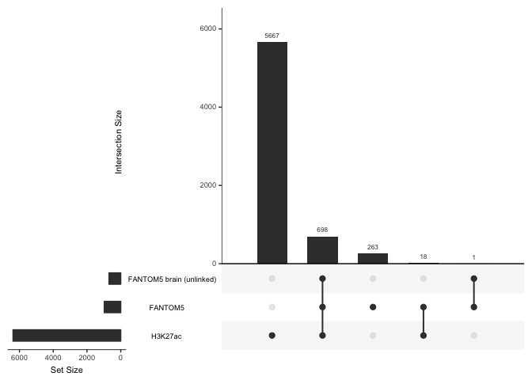

DMR-CpGs
--------

Counting CpGs in DMRs rather than number of DMRs hit an enhancer

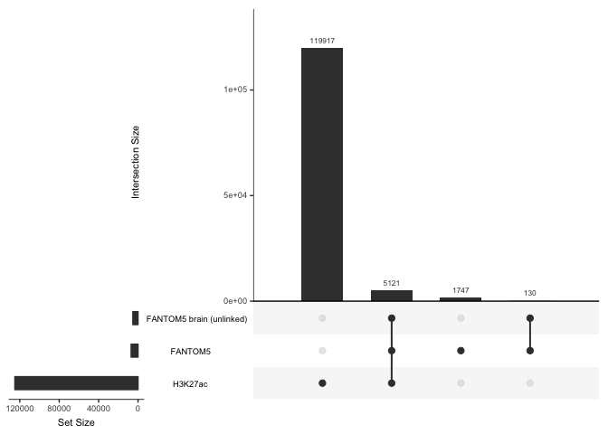

bigDMRs
-------

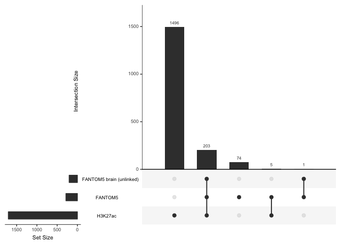

bigDMR-CpGs
-----------

Counting CpGs in bigDMRs rather than number of bigDMRs

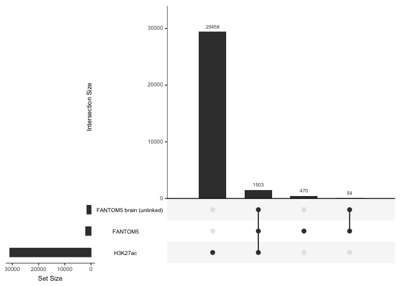

Summary
-------

-   Roughly 50% of DMRs overlap with `H3K27ac_brain`

Enhancer enrichment/depletion of DMR-CpGs and bigDMR-CpGs
=========================================================

Using all POS DMRs

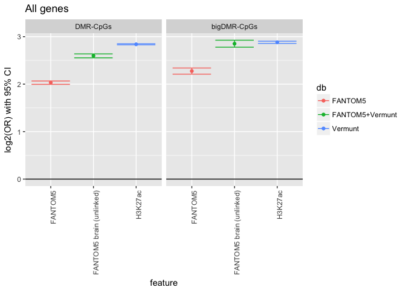

Summary
-------

-   DMR-CpGs especially enriched in all enhancers, especially `H3K27ac_brain`

Enhancer context of DARs and bigDARs
====================================

Using all NA\_pos vs. BA9\_pos DARs

DARs
----

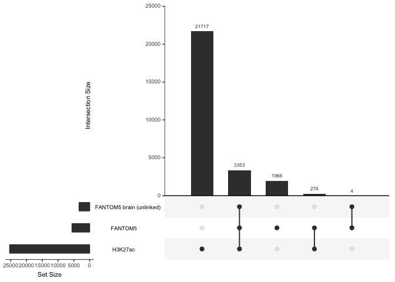

bigDARs
-------

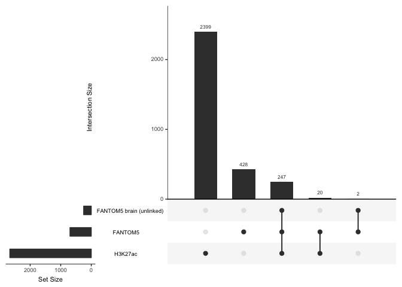

Summary
-------

-   Roughly 38% of DARs overlap with `H3K27ac_brain`

Enhancer enrichment/depletion of ATAC-seq peaks, DARs, and bigDARs
==================================================================

We consider enrichment of:

1.  Peaks vs. rest of genome
2.  DARS vs. rest of genome
    1.  bigDARs vs. rest of genome
3.  DARs vs. null-peaks
    1.  bigDARs vs. null-peaks Note that the non-DARs will still have some 'differential' peaks (`adj.P.Val < 0.05` but with a `abs(logFC) < 1`) whereas the null-peaks are those with `adj.P.Val > 0.05`.

We consider two different ways to calculate enrichment using ATAC-seq data:

A. Counting peaks (only 3, 4) B. Counting bases (1, 2, 3, 4)

Counting peaks
--------------

### DARs vs. null-peaks

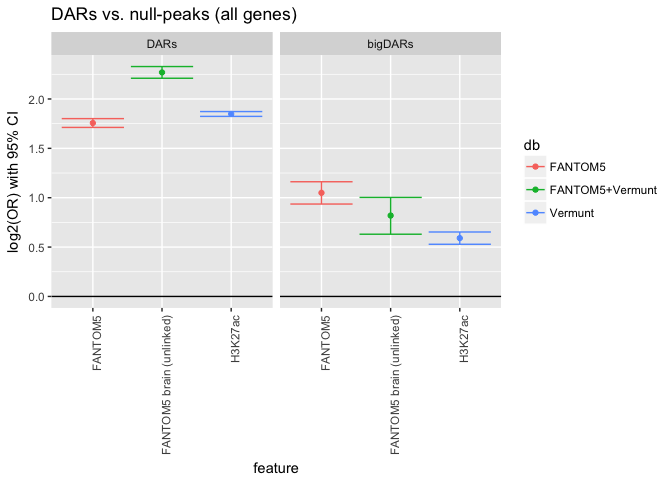

Counting bases
--------------

### Peaks vs. rest of genome

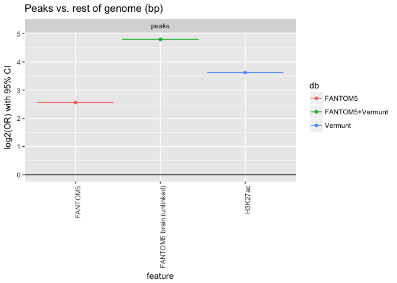

### DARS vs. rest of genome

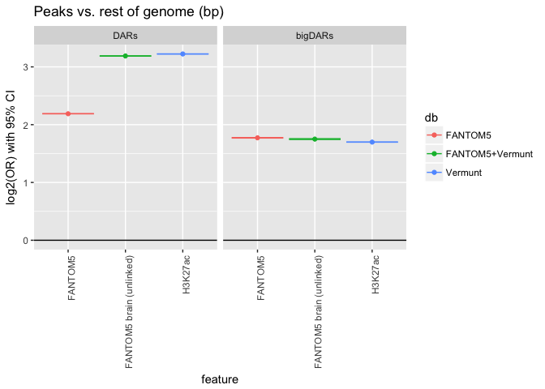

### DARs vs. null-peaks

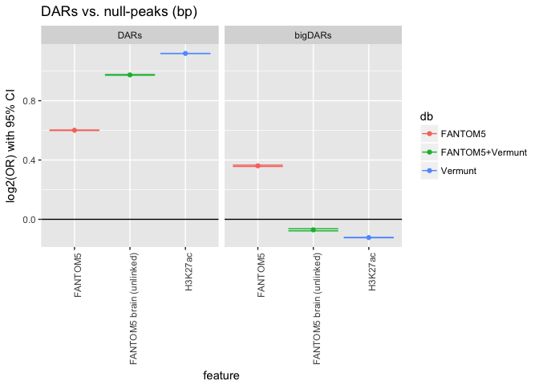
