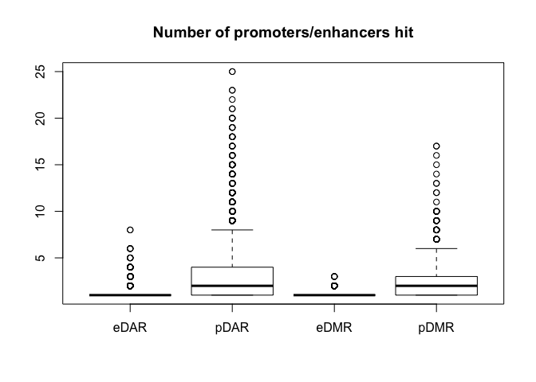
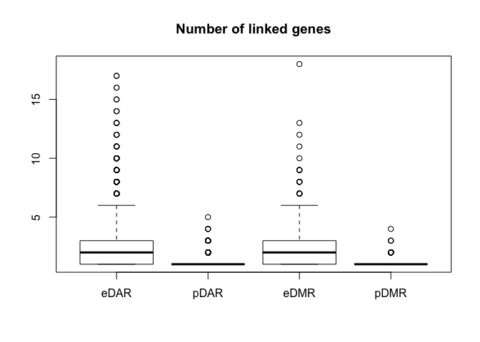
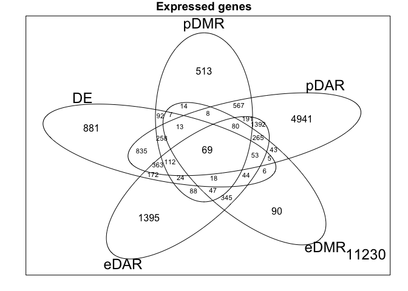
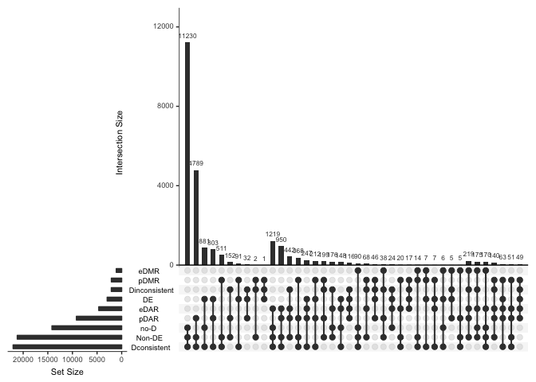
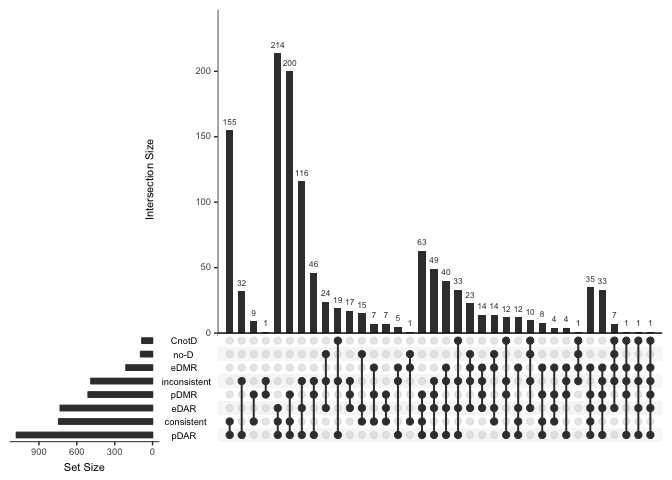

Analysis of DMRs and DARs over promoters and enhancers and their effect on gene expression
================
Peter Hickey
4 July 2017

-   [Abbreviations](#abbreviations)
-   [Focusing on just promoters](#focusing-on-just-promoters)
    -   [Interesting categories](#interesting-categories)
-   [Do DEGs with no pD have an 'active' promoter?](#do-degs-with-no-pd-have-an-active-promoter)
-   [Does an eD explain DEGs without pD?](#does-an-ed-explain-degs-without-pd)
    -   [Interesting categories](#interesting-categories-1)
    -   [DEGs with no pD but with eD](#degs-with-no-pd-but-with-ed)
-   [Promoter status of DEGs with no PD](#promoter-status-of-degs-with-no-pd)
    -   [CGI-promoter status](#cgi-promoter-status)
    -   [Open promoter status](#open-promoter-status)
-   [Genes per enhancer](#genes-per-enhancer)
-   [Are eDMR/eDAR linked to more genes that pDMR/pDAR?](#are-edmredar-linked-to-more-genes-that-pdmrpdar)
    -   [Number of promoters/enhancers hit per DMR/DAR](#number-of-promotersenhancers-hit-per-dmrdar)
    -   [Number of linked genes per eDMR/eDAR/pDMR/pDAR](#number-of-linked-genes-per-edmredarpdmrpdar)
-   [Promoters and enhancers](#promoters-and-enhancers)
    -   [Interesting categories](#interesting-categories-2)
    -   [Non-DEGs with a peD](#non-degs-with-a-ped)
-   [Venn diagrams and upset plots](#venn-diagrams-and-upset-plots)
    -   [Crazy 5-way Venn diagram](#crazy-5-way-venn-diagram)
    -   [Upset plot of all expressed genes](#upset-plot-of-all-expressed-genes)
    -   [Upset plot of all DEGs with npeD &gt; 1](#upset-plot-of-all-degs-with-nped-1)
-   [Is an enhancer active in our samples?](#is-an-enhancer-active-in-our-samples)
-   [Does the number of (consistent) pD, eD, or peD predict DEG-status?](#does-the-number-of-consistent-pd-ed-or-ped-predict-deg-status)
    -   [pD](#pd)
    -   [eD](#ed)
    -   [peD](#ped)
    -   [Summary](#summary)
-   [Questions](#questions)

Abbreviations
=============

-   `p`: promoter
-   `e`: enhancer
-   `peD`: pDMR or eDMR or pDAR or eDMR

Focusing on just promoters
==========================

The analysis and store are simplified if we first focus on pDs

Interesting categories
----------------------

-   There are 1849 DEGs with a pD
    -   There are 797 DEGs with &gt; 1 pD
-   There are 8149 non-DEGs with a pD
    -   There are 2000 non-DEGs with &gt; 1 pD
-   There are 1103 DEGs without a pD

### DEGs with a pD

Working backwards (most consistent -&gt; least consistent), breaking down and exploring the inconsistent categories along the way

-   1480 / 1849 genes are *jointly* consistent in their pD and their gene expression
    -   175 / 369 of those inconsistent genes have `npD == 1`
    -   194 of those inconsistent genes have `npD > 1`
        -   41 / 194 of these genes are *jointly* consistent in pD
        -   We plot those remaining 153 inconsistent genes (see [`../figures/DEGs-inconsistent-pD.pdf`](../figures/DEGs-inconsistent-pD.pdf))

### Non-DEGs with a pD

It is only interesting to check epigenetic consistency of those genes with `npD > 1`. It's less interesting/meaningful to check consistency with gene expression because these genes aren't differentially expressed and so the directionality is fairly arbitrary/random

-   4429 / 8149 genes are *jointly* consistent in their pD and their gene expression
    -   2659 / 3720 of those inconsistent genes have `npD == 1`
    -   1061 / 3720 of those inconsistent genes have `npD > 1`
        -   504 / 1061 of these genes are *jointly* consistent in their epigenetic marks
        -   We plot those remaining 557 inconsistent genes (see [`../figures/non-DEGs-inconsistent-pD.pdf`](../figures/non-DEGs-inconsistent-pD.pdf))

Do DEGs with no pD have an 'active' promoter?
=============================================

-   974 / 1103 of these genes have an OCR in a promoter ('active' promoter)

Does an eD explain DEGs without pD?
===================================

-   There are 1103 DEGs without a pD
    -   534 of these 1103 have at least one TSS-associated FANTOM5 enhancer
        -   477 of these 534 have at least one 'active' enhancer (i.e. overlap an ATAC-seq peak)

Interesting categories
----------------------

-   There are 534 DEGs without a pD but with a linked enhancer
    -   222 / 534 have a eD
        -   95 / 222 have `neD > 1`
    -   312 / 534 of these have no eD
-   There are 569 DEGs without a pD or linked enhancer

DEGs with no pD but with eD
---------------------------

-   106 / 222 genes are *jointly* consistent in their eD and their gene expression
    -   51 / 116 of those inconsistent genes have `neD == 1`
    -   65 / 116 of those inconsistent genes have `neD > 1`
        -   18 / 65 of these inconsistent genes are *jointly* consistent in eD
        -   We plot those remaining 47 inconsistent genes (see [`../figures/DEGs-no-pD-inconsistent-eD.pdf`](../figures/DEGs-no-pD-inconsistent-eD.pdf))

Promoter status of DEGs with no PD
==================================

CGI-promoter status
-------------------

-   418 / 1103 DEGs with no pD don't have a CGI-promoter

Open promoter status
--------------------

-   129 / 1103 DEGs with no pD don't have an ATAC-seq peak in the promoter

Genes per enhancer
==================

-   Number of genes per enhancer

0% 10% 20% 30% 40% 50% 60% 70% 80% 90% 100% 1 1 1 1 1 2 2 3 4 6 37 0% 10% 20% 30% 40% 50% 60% 70% 80% 90% 100% 1 1 1 1 1 1 1 1 1 1 27

Are eDMR/eDAR linked to more genes that pDMR/pDAR?
==================================================

Only considering genes with both promoters and enhancer links

Number of promoters/enhancers hit per DMR/DAR
---------------------------------------------

-   More promoters than enhancers are hit per DMR/DAR because promoters overlap more than enhancers

Number of linked genes per eDMR/eDAR/pDMR/pDAR
----------------------------------------------

-   However, more genes are linked to each eDMR/eDAR than pDMR/pDAR because enhancers link to multiple genes more often than do promoters

Promoters and enhancers
=======================

-   10508 / 24161 expressed genes are linked to at least one FANTOM5 enhancer
-   1686 / 2952 DEGs are linked to at least one FANTOM5 enhancer

Interesting categories
----------------------

-   There are 2071 DEGs with a peD
    -   There are 1138 DEGs with &gt; 1 peD
-   There are 9979 non-DEGs with a peD
    -   There are 4263 non-DEGs with &gt; 1 peD
-   There are 881 DEGs without a peD

### DEGs with a peD

Working backwards (most consistent -&gt; least consistent), breaking down and exploring the inconsistent categories along the way

-   1421 / 2071 genes are *jointly* consistent in their pD and their gene expression
    -   161 / 650 of those inconsistent genes have `npeD == 1`
    -   489 / 650 of those inconsistent genes have `neD > 1`
        -   85 / 489 of these DEGs are *jointly* consistent in peD
        -   The remaining 404 inconsistent DEGs include those 153 genes with inconsistent pDs (at least, if they have an enhancer). We plot the 251 'new' DEGs found by also examining eDs (see [`../figures/DEGs-inconsistent-peD.pdf`](../figures/DEGs-inconsistent-peD.pdf))

Non-DEGs with a peD
-------------------

It is only interesting to check epigenetic consistency of those genes with `npeD > 1`. It's less interesting/meaningful to check consistency with gene expression because these genes aren't differentially expressed and so the directionality is fairly arbitrary/random

-   8271 / 9979 non-DEGs are *jointly* consistent in their peD and their gene expression
    -   0 / 1708 of those inconsistent genes have `npD == 1`
    -   1708 / 1708 of those inconsistent genes have `neD > 1`
        -   0 / 1708 of these genes are *jointly* consistent in their epigenetic marks
        -   The remaining 1708 inconsistent genes include those 557 genes with inconsistent pDs (at least, if they have an enhancer). We plot the 1151 'new' genes found by also examining enhancer epigenetic marks (see [`../figures/non-DEGs-inconsistent-peD.pdf`](../figures/non-DEGs-inconsistent-peD.pdf))

### DEGs with no peD

-   757 / 881 of these genes have an ATAC-seq peak in a promoter or enhancer

Venn diagrams and upset plots
=============================

Some example summary figures

Crazy 5-way Venn diagram
------------------------

Upset plot of all expressed genes
---------------------------------

Upset plot of all DEGs with npeD &gt; 1
---------------------------------------

Is an enhancer active in our samples?
=====================================

-   Q: Can we identify a subset of active enhancers in our cells by looking for overlap of FANTOM5 enhancers and OCRs?
    -   A: There are 52558 (TSS-associated enhancer, gene)-pairs with an ATAC-seq peak over the enhancer
-   Q: How many genes have at least 1 enhancer with an ATAC-seq peak?
    -   A: There are 10457 genes with at least 1 enhancer with an ATAC-seq peak
        -   9458 / 10457 are expressed genes
        -   1537 / 10457 are DEGs

Does the number of (consistent) pD, eD, or peD predict DEG-status?
==================================================================

Take all expressed genes with consistent pD, eD, or peD and cross-tabulate npD, neD, or npeD with DE-status. Note, all genes with `npeD < 2` are automatically peD consistent, for example.

pD
--

    #> # A tibble: 13 x 3
    #> # Groups:   npD [13]
    #>      npD `Not DE`    DE
    #>  * <int>    <int> <int>
    #>  1     0    13060  1103
    #>  2     1     6149   877
    #>  3     2     1119   331
    #>  4     3      233   143
    #>  5     4       65    77
    #>  6     5       15    23
    #>  7     6       10    14
    #>  8     7        0     6
    #>  9     8        1     5
    #> 10    10        0     1
    #> 11    11        0     1
    #> 12    13        0     1
    #> 13    22        0     1

As percentages:

    #> # A tibble: 13 x 3
    #>      npD `Not DE`    DE
    #>    <int>    <dbl> <dbl>
    #>  1     0    63.24 42.70
    #>  2     1    29.77 33.95
    #>  3     2     5.42 12.81
    #>  4     3     1.13  5.54
    #>  5     4     0.31  2.98
    #>  6     5     0.07  0.89
    #>  7     6     0.05  0.54
    #>  8     7     0.00  0.23
    #>  9     8     0.00  0.19
    #> 10    10     0.00  0.04
    #> 11    11     0.00  0.04
    #> 12    13     0.00  0.04
    #> 13    22     0.00  0.04

eD
--

    #> # A tibble: 13 x 3
    #> # Groups:   neD [13]
    #>      neD `Not DE`    DE
    #>  * <int>    <int> <int>
    #>  1     0    17251  2066
    #>  2     1     2177   331
    #>  3     2      663   114
    #>  4     3      187    37
    #>  5     4       64    16
    #>  6     5       29     5
    #>  7     6       20     7
    #>  8     7        8     3
    #>  9     8        4     2
    #> 10     9        4     0
    #> 11    10        0     1
    #> 12    11        1     0
    #> 13    13        0     2

As percentages:

    #> # A tibble: 13 x 3
    #>      neD `Not DE`    DE
    #>    <int>    <dbl> <dbl>
    #>  1     0    84.53 79.95
    #>  2     1    10.67 12.81
    #>  3     2     3.25  4.41
    #>  4     3     0.92  1.43
    #>  5     4     0.31  0.62
    #>  6     5     0.14  0.19
    #>  7     6     0.10  0.27
    #>  8     7     0.04  0.12
    #>  9     8     0.02  0.08
    #> 10     9     0.02  0.00
    #> 11    10     0.00  0.04
    #> 12    11     0.00  0.00
    #> 13    13     0.00  0.08

peD
---

    #> # A tibble: 18 x 3
    #> # Groups:   npeD [18]
    #>     npeD `Not DE`    DE
    #>  * <int>    <int> <int>
    #>  1     0    11230   881
    #>  2     1     5716   677
    #>  3     2     1703   372
    #>  4     3      501   160
    #>  5     4      195    92
    #>  6     5       80    47
    #>  7     6       40    31
    #>  8     7       17    17
    #>  9     8       10     6
    #> 10     9        3     4
    #> 11    10        3     4
    #> 12    11        3     3
    #> 13    12        0     2
    #> 14    13        0     1
    #> 15    14        0     2
    #> 16    17        0     1
    #> 17    18        0     1
    #> 18    25        0     1

As percentages:

    #> # A tibble: 18 x 3
    #>     npeD `Not DE`    DE
    #>    <int>    <dbl> <dbl>
    #>  1     0    57.59 38.27
    #>  2     1    29.31 29.41
    #>  3     2     8.73 16.16
    #>  4     3     2.57  6.95
    #>  5     4     1.00  4.00
    #>  6     5     0.41  2.04
    #>  7     6     0.21  1.35
    #>  8     7     0.09  0.74
    #>  9     8     0.05  0.26
    #> 10     9     0.02  0.17
    #> 11    10     0.02  0.17
    #> 12    11     0.02  0.13
    #> 13    12     0.00  0.09
    #> 14    13     0.00  0.04
    #> 15    14     0.00  0.09
    #> 16    17     0.00  0.04
    #> 17    18     0.00  0.04
    #> 18    25     0.00  0.04

Summary
-------

-   Some discriminatory power when looking at pD or peD
-   Little discriminatory power when looking at eD

Questions
=========

-   \[ \] Q: Is it worth trying to track down the 'cause' in the case of the small number of DEGs with inconsistent peD (let alone those non-DEGs with inconsistent peDe)?
    -   \[ \] Identify DMR/DAR that results in a peD(s) with the 'incorrect' sign and see if these can be assigned to a peD with the 'correct' sign
-   \[ \] Q: Use all enhancers or all 'active' enhancers?
